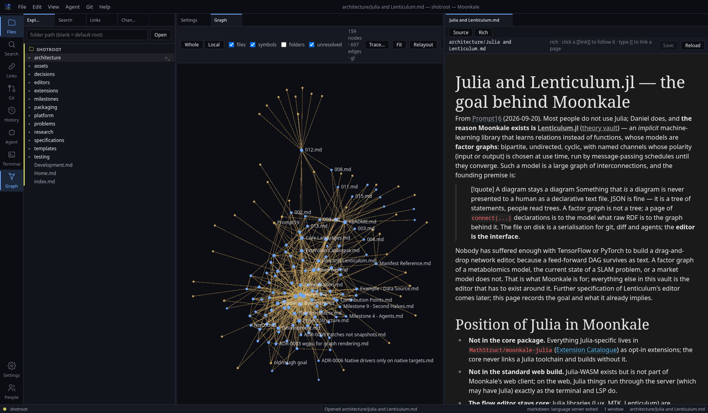
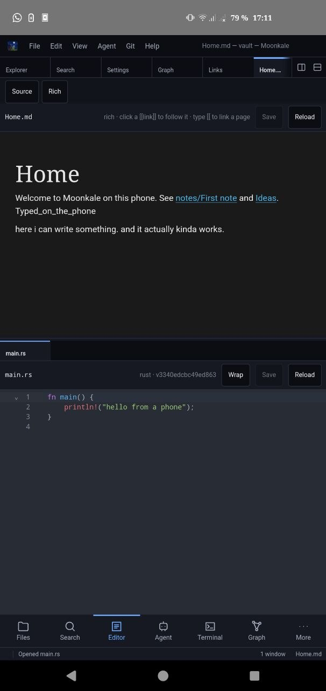

  
  

Desktop (2026-09-20): the vault's graph next to a note in the rich editor · Phone (Galaxy S10e): a note and a Rust file with the bottom bar.

# Moonkale (Under development)

**A graph-native code and knowledge editor.**

Moonkale opens *folders and databases* — a source tree, a Postgres schema, a
TypeDB or LadybugDB graph, a Redis keyspace, an Obsidian-style wiki — and shows
them as **one graph**. Every editor is a view on that graph: a code editor with
language-server support, a WYSIWYG Markdown/Typst editor with wiki-links, a
table/SQL editor, a GPU-rendered 2D/3D graph view that stays fluid at 100k+
nodes, a drag-and-drop flow editor (first target: building Lux.jl models), and
a terminal whose stack traces become clickable subgraphs. Language servers,
indexers and LLM agents all work on the same graph through the same doors.

It is built in **Rust** with [Dioxus](https://dioxuslabs.com) for desktop, web
and mobile from a single codebase, and it is **extension-driven**: the built-in
editors are extensions with no privileged access, so anything they can do, a
third-party extension can do.

Moonkale grew out of the frustration that code editors, knowledge editors,
database tools and no-code tools are separate worlds — and that none of them
were built with graph databases or retrieval-augmented agents in mind.

## Install

Packages for every release are on the
[releases page](https://github.com/MathStruct/Moonkale/releases):

| platform | file | install |
|---|---|---|
| Arch Linux | `moonkale-bin-<v>-1-x86_64.pkg.tar.zst` | `sudo pacman -U <file>` |
| Debian 12+ / Ubuntu 22.04+ | `moonkale_<v>_amd64.deb` | `sudo apt install ./<file>` |
| Nix / NixOS | (from source) | `nix profile install github:MathStruct/Moonkale` |
| any Linux | `moonkale-<v>-linux-x86_64.tar.gz` | unpack, `./bin/moonkale`, or `./install.sh ~/.local` |
| Windows / macOS | `.msi` / `.exe` / `.dmg` | **unsigned and untested** — see the install page |

Details, what the unsigned warnings mean, and how to report a problem:
[Install](https://mathstruct.github.io/Moonkale/packaging/Install). To build
the packages yourself: `packaging/build-release.sh` (Linux) — the same script
the release workflow runs.

## Where it stands

**Milestone 14 — "A Rust code editor"** (2026-09-21). A second code
editor built on `dioxus-code-editor` — tree-sitter highlighting compiled to
Rust and wasm for every core language, Lean, Nix and Typst included — next
to CodeMirror, switchable per document; the word under the caret is a
workspace signal for both.

**Milestone 13 — "Packaging"** (2026-09-21). Packages to hand to friends:
an Arch package, a `.deb`, a Nix flake, a tarball with an installer, and a
GitHub release workflow that also produces Windows and macOS bundles
(unsigned, untested). Every extension's settings now sit with the extension
in the Extensions panel.

**Milestone 12 — "Agents and a native terminal"** (2026-09-21). Claude
Code is one of Moonkale's agents — on the subscription, no API key — and
agent sessions can live on the server, finishing without a window and
readable from the phone, which can now *Connect to Server…*. The first
JavaScript-free editor: a Rust/Dioxus terminal next to the xterm.js one,
with a chooser. An Extensions button in the activity bar.

**Milestone 11 — "Remote"** (2026-09-21). *File → Open Remote Folder…*:
the system `ssh` runs in a terminal tab (your keys, agent, passwords and
host-key prompts, untouched by Moonkale), Moonkale's own server is copied to
the host once per version and started on its loopback with a per-session
token over stdin, the port is forwarded — the folder, index, LSP, git and
terminal run *there*, the editor, the graph and the LLM keys stay *here*;
closing the folder ends everything. A standalone `moonkale-server` with
built-in TLS, a terminal switch and Origin checks for the servers you
expose. Also `moonkale --ssh host:/path`.

**Milestone 10 — "Daily use"** (2026-09-21). Nineteen small specifications
from daily use, all done: KaTeX formulas and Obsidian-style `[[wiki-links]]`
in the rich editor, syntax highlighting for the core languages, word wrap,
closeable panels, an image viewer, an activity bar with menus and source
icons, front matter as properties, two-finger gestures on Android.

**Milestone 9 — "Second halves"** (2026-09-19). History you can act on —
compaction into snapshots and *Restore* of any earlier text as an unsaved
edit with provenance; presence with cursor lines in the editor gutter and a
desktop hub client; node dragging in 3D; DuckDB — `.duckdb` files and
folders of CSV/TSV/Parquet as queryable tables. And the first **Android**
build: the release APK runs on a Galaxy S10e (phone shell, editor with the
soft keyboard, save + history, graph on WebGL2). Twenty-seven automated
browser suites.

**Milestone 8 — "Research"** (2026-09-19). An entity log of every
change in a workspace (user, agent or git checkpoint) with a History panel
that shows any file as it was after any event; presence — who else is in
the folder and what they look at; a 3D graph with one plane per node kind
and an orbiting camera; and wasm extensions running in the browser (a
Worker with a SharedArrayBuffer mailbox, host calls answered by the
client). Twenty-six automated browser suites cover it, one of them the
first to exercise the wgpu renderer (Chromium + SwiftShader).

**Milestone 7 — "Daily driver"** (2026-09-19). A command palette
and quick open over a command registry with rebindable keys; file operations
in the Explorer (new, rename, move, delete to trash) that open documents and
the index follow; find & replace in a file and across the workspace; the
second half of LSP (completion, rename, code actions, references); git as a
Changes panel with diffs, staging, commits and the history drawn as a graph;
and an access token so the web server can be exposed. Twenty-three
automated browser suites cover it.

**Milestone 6 — "Scale & extend"** (2026-09-19). Extensions are
a managed catalog (Settings → Extensions toggles them and grants permissions;
the Flow editor and the Lux.jl library ship off); a flow editor with typed
ports and block libraries contributed by extensions; a Lux.jl library that
generates `model.jl`; third-party wasm extensions (core modules, JSON ABI,
wasmtime, permissions enforced at the host boundary) whose commands become
agent tools; Barnes–Hut layout that settles 100k nodes at ~170 ms/step; a
phone-sized shell below 700 px. Seventeen automated browser suites cover it.

**Milestone 5 — "Settings & writing"** (2026-09-18). Moonkale
remembers layouts, open documents and recent folders per workspace, and
provider/policy choices in two scopes (machine and folder) with a Settings
panel (`Ctrl+,`); markdown has a Rich (WYSIWYG) mode; the agent can edit
files and run commands through diff/command cards under the policy gate;
an MCP endpoint lets Claude Code and other external agents query the open
workspace. Twelve automated browser suites cover it.

**Milestone 4 — "Agents"** (2026-09-18). An in-app agent
(Anthropic, OpenAI-compatible, Ollama, or an offline mock) that lists the
open sources, browses the graph, reads files, runs read-only SQL/Cypher and
searches — every tool call through a policy gate with approval prompts and
an audit log, transcripts saved as indexed pages; hybrid search (BM25 +
optional embeddings, Ctrl+Shift+F); stack traces and compiler errors drawn
as graphs from the terminal. That sits on Milestone 3's terminal, Typst
preview, LSP client and LadybugDB source; Milestone 2's index, wgpu graph
view, backlinks and SQLite tables; and Milestone 1's dockable workbench —
desktop and web from one codebase. Eleven automated browser suites cover it.

Still comment-only skeleton: Postgres/Falkor/KV drivers, browser-side wasm
extensions, collaboration. The **design vault** in `markdown/`
records every decision and is published at
**<https://mathstruct.github.io/Moonkale/>**; each implemented crate also has
a `<crate>.md` next to its code.

Next: Android folder access through the Storage Access Framework and a signed release; then Postgres/Turso, TypeDB/Helix, a JS-free desktop and CRDT text merge — all waiting for an environment or a milestone of their own.

## License

Moonkale is released under the **MIT License** — see [LICENSE](LICENSE).

That covers the code in this repository. What you *build* also contains
third-party software under its own licenses, all permissive but not all
MIT — a binary or bundle is a combination, and their notices travel with
it:

- Rust crates: 991 in the lock file, mostly `MIT OR Apache-2.0`; notable
  ones bundled into the binaries are **DuckDB** (MIT), **LadybugDB/Kuzu** (MIT),
  **wasmtime** (Apache-2.0 WITH LLVM-exception), **Typst** (Apache-2.0),
  **tree-sitter** and its grammars (MIT), **rustls** (Apache-2.0/ISC/MIT),
  the **ICU4X** crates (Unicode-3.0), `webpki-roots` (CDLA-Permissive-2.0),
  `option-ext` (MPL-2.0). No GPL/LGPL-only crate is in the tree.
- JavaScript bundled into the app: **CodeMirror**, **Milkdown**, **xterm.js**,
  **KaTeX** (all MIT); the KaTeX **fonts** are SIL Open Font License 1.1.
- The documentation site is built with **Quartz** (MIT).

To list every dependency with its license: `cargo install cargo-license`
then `cargo license` in the workspace (Rust), and `npm ls --all` with
`license-checker` in each `packages/js/*` package (JavaScript).

## Learn more

- Website / design docs: <https://mathstruct.github.io/Moonkale/>
- Start with *Overview*, then *Project Structure*, then *Roadmap*.
- Building, running, testing and how the site is published: the
  [Development](markdown/Development.md) page.

Moonkale is a [MathStruct](https://mathstruct.github.io/) project.
