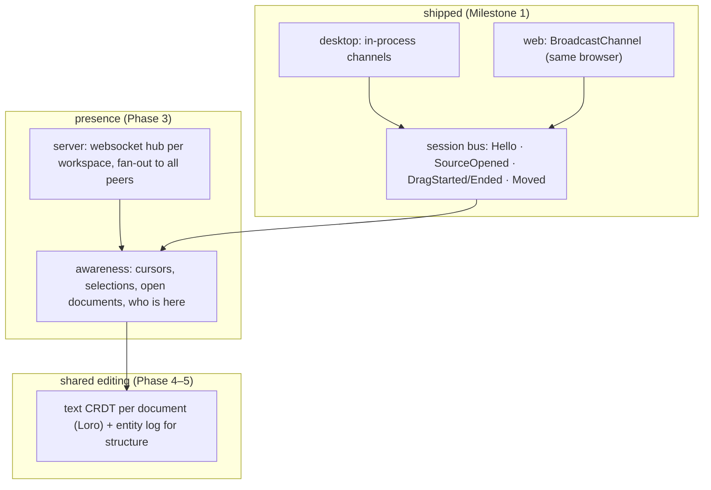

Collaboration in Moonkale grows out of something that already ships: **the session bus**. Every window or tab of one user is a *peer*; a user on another machine is a peer behind the server. Same messages, different transport — so the multi-window feature built in Milestone 1 is the first, zero-latency, single-actor form of collaboration. This note extends it to many people. Related: [[Version Management]] (the entity log is the shared history), [[LLM and RAG]] (agents are peers too).

## Layers



### 1. Session bus (exists)
`moonkale_ext_api::session`: `WindowId`, `SessionMessage`, `trait SessionBus { send }`. A window announces itself (`Hello`), peers reply with their open sources, and documents can be dragged between windows (`DragStarted` → drop target in every other peer → `Moved` → origin closes). The transport is per platform; the messages are serde JSON so they already survive a browser hop (which is why `Version` is serialised as a string — 64-bit hashes don't fit in a JavaScript number).

### 2. Presence / awareness
Small, frequent, **ephemeral** state that is never stored in the entity log: where each peer's cursor and selection are, which document is active, a display name and colour, "is typing". Modelled on Yjs's *awareness* protocol:

```text
Presence {
  peer: PeerId,            // (user, window) — a user with two windows is two peers
  user: UserId, name, colour,
  focus: Option<NodeId>,   // active document
  cursor: Option<{ node: NodeId, anchor: usize, head: usize }>,   // char offsets
  seen_at: Timestamp,      // peers expire when it goes stale
}
```

- Rendering: other users' carets and selections as decorations in the [[Code Editor]] (the decoration channel already exists for highlights/diagnostics) and as coloured dots on Explorer entries and tabs; a "who's here" list in the status bar.
- Transport: the same session bus, extended with `Presence(Presence)`; on desktop within one process it is free, across machines it goes through the server hub.
- Cost model: presence is sent on change, throttled (~20 Hz cap), last-write-wins per peer, dropped when stale. Nothing here needs consistency.

### 3. The server as synchronisation hub
[[ADR-0005 Server functions as the remote backend]] already makes `api` the place where sources live for web clients. Collaboration adds one **websocket per (client, workspace)**:

- **Fan-out**: every `SessionMessage`/`Presence` a client sends is relayed to the other clients of that workspace. Desktop clients connect to the same hub when they open a shared workspace ("connect to team server"), so desktop and web users share one session.
- **Authority**: the server owns the sources (folder or database), so it is naturally the serialisation point for writes; today's optimistic `Version` check becomes "the server applies transactions in arrival order and broadcasts the resulting events" — which is exactly the entity log of [[Version Management]] being appended by many actors.
- **Auth and rooms**: workspace = room; users authenticate to the hub; permissions per source (read/write) — the same permission model extensions get ([[Host API Reference]]).
- **Offline/desktop-first**: the local entity log keeps working without a hub; on reconnect, logs merge (structural events commute; content goes through the CRDT).

### 4. Shared editing
Two people typing in the same document need more than versions: a **text CRDT** per document (`loro` or `automerge`, both Rust; Loro's rich-text and tree types map well onto Markdown and flow graphs). Plan:
- `Document.text` becomes a CRDT text; the editor backend applies remote ops as `setText`/splices, local edits become ops. The current whole-document `change` events would be replaced by real splices at this point (P-037).
- The entity log records a `Content` event per CRDT transaction — history stays one log.
- Saving to a folder source writes the merged text; git sees ordinary commits.
- Conflict-free *structure* (adds/removes) is already given by the entity log's set semantics.

## What the multi-window work decided for collaboration
- Messages are **typed Rust enums with serde**, never ad-hoc JSON — so the server hub can be written in the same types.
- A window is identified by a random `WindowId`, a user later by `UserId`; presence uses the pair. Nothing assumes one window per user.
- **Sources are attached by descriptor** (`AttachSource`): a peer that learns of a source can open it without a path — the exact shape a hub needs to hand a newcomer the room's sources.
- Drag-and-drop between windows is a *move* (`Moved` closes the origin) — not a shared edit. The OS-level HTML5 drop is used where the platform delivers it; otherwise the offer persists as a **banner** in every other window after `dragend` ("README.md was dragged from another window — Move it here"), so the gesture degrades to grab-then-click instead of failing (P-044). Two windows editing the same document is deliberately unsupported until the CRDT exists; the conflict is caught by the version check on save.

## Open questions (→ [[Problem Ranking]] P-34, P-30)
- Presence for the [[Graph View]]: show other users' viewports/selections on the graph? Probably yes, same channel.
- Should agents publish presence ("agent X is reading main.rs")? Useful for trust; cheap.
- Hub scale: one Axum task per room with a broadcast channel is enough for teams; beyond that, a message broker.
