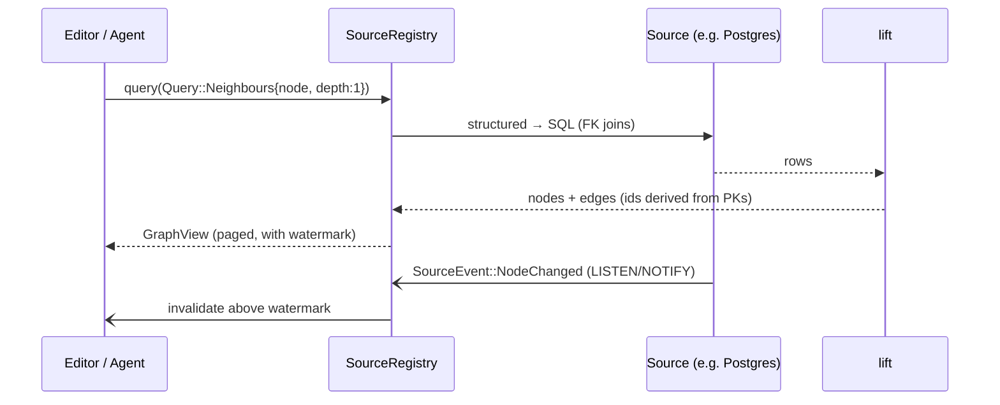

# Data Sources

Crates: `sources` (abstraction, registry, lifting, remote proxy), `sources-sql`, `sources-graph`, `sources-kv`, `project-fs`. Driver availability is in [[Database Backends]].

## Query path

## Families

| Family | Node kinds | Edge kinds | Text dialect | Notes |
|---|---|---|---|---|
| Folder | `Directory`, `File` | `Contains` | — | all platforms; backends differ |
| SQL | `Table`, `Column`, `Row` | `Contains`, `ForeignKey` | SQL | rows lifted lazily; PK → id |
| Graph | `Vertex`, typed | 1:1 relations | Cypher / TypeQL / HelixQL | the natural fit |
| KV | synthetic hierarchy + `Key` | `Contains` | raw commands | key patterns make it navigable |
| Remote | any | any | any | proxy to `api`; the only source on web |

## Lifting rules (`sources::lift`)
- **Tables without a primary key** get unstable ids (`ctid`/`rowid`/hash) and the descriptor flags them; editors show a warning and disable inline edit.
- **Foreign keys become edges** on demand (neighbour queries), never eagerly.
- **Schema is a graph too**: `Table`/`Column` nodes with `Contains`, `ForeignKey` edges between tables — so the schema view is the graph view.
- **KV patterns**: `user:{id}:{field}` → `user` → `42` → `profile`, configurable per source, auto-detected by sampling.
- **TypeDB**: attributes → properties; roles → `Custom` edge kinds carrying the role name.

## Capabilities, not brands
`Capabilities { READ, WRITE, WATCH, TEXT_QUERY(dialect), FULLTEXT, VECTOR, TRANSACTIONS }`. Editors and the LLM policy feature-detect. A read-only DuckDB file says `!WRITE`; a Redis without keyspace notifications says `!WATCH`; a Postgres with `pgvector` says `VECTOR`.

## Connections and secrets
`ConnectParams` are persisted with a `SecretRef` name, never a password. Resolution per platform: keychain (desktop), server env (web), Keystore (mobile). The connection state machine (`Connecting → Ready ↔ Degraded → Closed`) feeds the status bar dot.

## Remote source ([[ADR-0005 Server functions as the remote backend]])
`api` exposes `query/fetch/apply` as server functions and `subscribe` as a websocket, per `SourceId`, after auth. The web/mobile builds have one factory: `RemoteSource`. The desktop build has it too ("connect to a team server").

## Order of implementation (from [[Roadmap]])
1. Folder (native) — everything else needs files.
2. SQLite + DuckDB — embedded, no server, exercises the SQL lifting; DuckDB also gives "folder of CSV/parquet as tables".
3. Remote proxy — web parity.
4. Postgres/Supabase, Turso.
5. LadybugDB (embedded) and FalkorDB (simple protocol) — first graph backends.
6. Redis/Dragonfly.
7. TypeDB, HelixDB — richer, less mature drivers.

## Open questions
- Supabase's REST/RPC layer would allow a *browser-direct* source. Deferred; treat as Postgres for now.
- Should `IndexSource` (derived data) be allowed to *write back* (e.g. materialise embeddings into `pgvector`)? Leaning yes, behind `Capabilities::VECTOR`.
