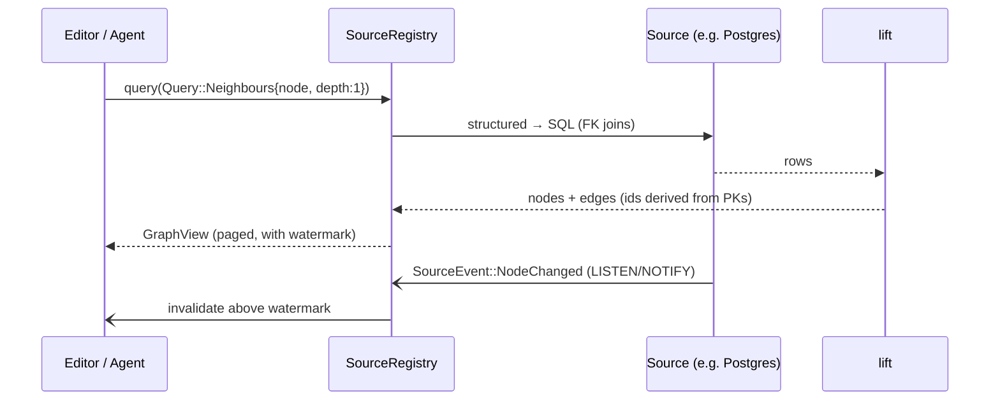

Crates: `sources` (abstraction, registry, lifting, remote proxy), `sources-sql`, `sources-graph`, `sources-kv`, `project-fs`. Driver availability is in [[Database Backends]].

> [!note] As built (2026-10-01)
> Built: folders; SQLite, DuckDB (+ folders of CSV/TSV/Parquet), Turso, redb, RocksDB, HelixDB (embedded), LadybugDB (Linux) — **all opened from a file or directory, all read-only**; the remote proxy. Not built: any networked database (Postgres, Redis, TypeDB, FalkorDB), connection parameters with `SecretRef`, the connection state machine, `SourceEvent` subscriptions (sources report external changes through `changes_since` instead), and the shared lifting rules (`sources::lift` is a stub — each driver lifts its own rows and decides its own ids). `Capabilities` has `read`, `write`, `watch`, `text_query` only. Which file opens as which source is decided in four places today; [[Milestone 18 - Library Refactor]] phase 2 makes it a *source opener* contribution.

## Query path

```mermaid
sequenceDiagram
  participant E as Editor / Agent
  participant R as SourceRegistry
  participant S as Source (e.g. Postgres)
  participant L as lift
  E->>R: query(Query::Neighbours{node, depth:1})
  R->>S: structured → SQL (FK joins)
  S-->>L: rows
  L-->>R: nodes + edges (ids derived from PKs)
  R-->>E: GraphView (paged, with watermark)
  S-)R: SourceEvent::NodeChanged (LISTEN/NOTIFY)
  R-)E: invalidate above watermark
```

## Families

| Family | Node kinds | Edge kinds | Text dialect | Notes |
|---|---|---|---|---|
| Folder | `Directory`, `File` | `Contains` | — | all platforms; backends differ |
| SQL | `Table`, `Column`, `Row` | `Contains`, `ForeignKey` | SQL | rows lifted lazily; PK → id |
| Graph | `Vertex`, typed | 1:1 relations | Cypher / TypeQL / HelixQL | the natural fit |
| KV | synthetic hierarchy + `Key` | `Contains` | raw commands | key patterns make it navigable |
| Remote | any | any | any | proxy to `api`; the only source on web |

## Lifting rules (`sources::lift`)
- **Tables without a primary key** get unstable ids (`ctid`/`rowid`/hash) and the descriptor flags them; editors show a warning and disable inline edit.
- **Foreign keys become edges** on demand (neighbour queries), never eagerly.
- **Schema is a graph too**: `Table`/`Column` nodes with `Contains`, `ForeignKey` edges between tables — so the schema view is the graph view.
- **KV patterns**: `user:{id}:{field}` → `user` → `42` → `profile`, configurable per source, auto-detected by sampling.
- **TypeDB**: attributes → properties; roles → `Custom` edge kinds carrying the role name.

## Capabilities, not brands
`Capabilities { READ, WRITE, WATCH, TEXT_QUERY(dialect), FULLTEXT, VECTOR, TRANSACTIONS }`. Editors and the LLM policy feature-detect. A read-only DuckDB file says `!WRITE`; a Redis without keyspace notifications says `!WATCH`; a Postgres with `pgvector` says `VECTOR`.

## Connections and secrets
`ConnectParams` are persisted with a `SecretRef` name, never a password. Resolution per platform: keychain (desktop), server env (web), Keystore (mobile). The connection state machine (`Connecting → Ready ↔ Degraded → Closed`) feeds the status bar dot.

## Remote source ([[ADR-0005 Server functions as the remote backend]])
`api` exposes `query/fetch/apply` as server functions and (later) `subscribe` as a websocket, per `SourceId`. The web/mobile builds have one factory: `api::RemoteSource`. The desktop build has it too ("connect to a team server").

**As built (Milestone 1):** `RemoteSource` lives in the `api` crate, not `sources`, to avoid a dependency cycle (it calls `api`'s server functions; `api` holds the registry). The server confines `open_folder` to `MOONKALE_ROOT`; there is no auth yet. Errors are nested `Result<Result<T, SourceError>, ServerFnError>` so a remote `Conflict` is a local `Conflict`.

## Order of implementation (from [[Roadmap]]), with where each stands
1. ✅ Folder (native) — everything else needs files.
2. ✅ SQLite + DuckDB — embedded, no server; DuckDB also gives "folder of CSV/parquet as tables".
3. ✅ Remote proxy — web parity.
4. ◐ Turso ✅ (embedded, Milestone 17) · Postgres/Supabase ○.
5. ◐ LadybugDB ✅ (embedded; Linux only, P-144) · FalkorDB ○.
6. ◐ redb, RocksDB ✅ (embedded key/value, Milestone 17, not in the original list) · Redis/Dragonfly ○.
7. ◐ HelixDB ✅ (embedded, git dependency, Milestone 17) · TypeDB ○.
8. ○ Writes (OLTP) for every database source — the next step announced after Milestone 17.

## Projects
Several sources open at once, grouped into a saved **project** with a selector, per-source colour and read-only, suspended sources, an open report and sync: [[Projects and Sources]] (desired behaviour, 2026-09-19).

## Open questions
- Supabase's REST/RPC layer would allow a *browser-direct* source. Deferred; treat as Postgres for now.
- Should `IndexSource` (derived data) be allowed to *write back* (e.g. materialise embeddings into `pgvector`)? Leaning yes, behind `Capabilities::VECTOR`.
