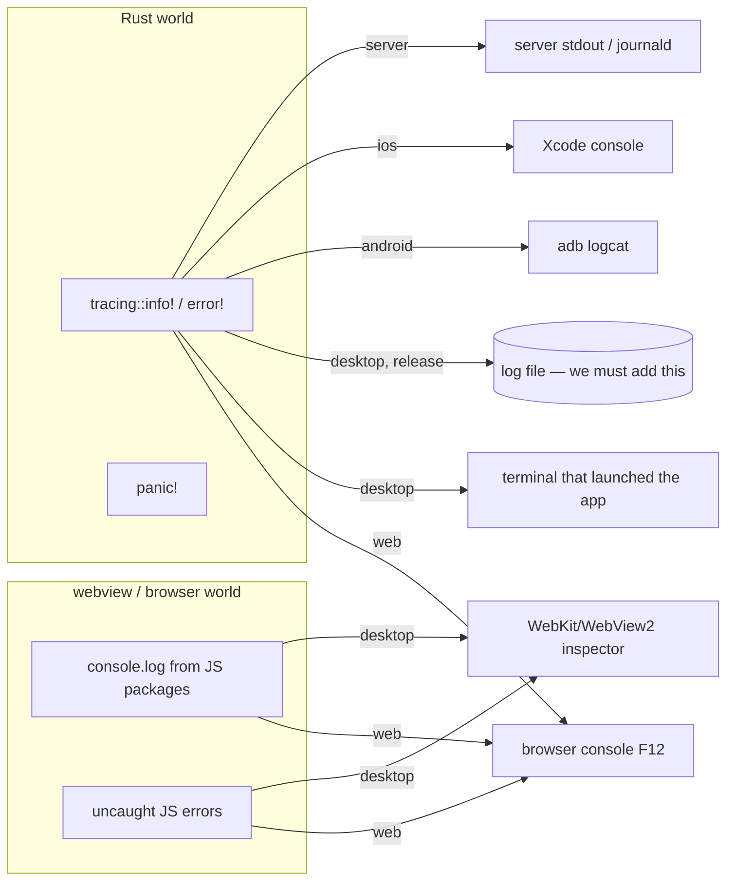

*"In a browser I hit F12. When this is compiled, how do I see what went wrong?"* — Per platform, per build type. Verified against Dioxus 0.7.10 sources on 2026-09-17.

## The mental model

There are **two worlds** in a Dioxus app and they log to different places:

`dioxus::launch` calls `dioxus::logger::initialize_default()` for you (DEBUG level in debug builds, INFO in release) — so `tracing::info!` works out of the box, and the *destination* is chosen per platform by `dioxus-logger`: browser console on wasm, stdout on desktop/server, logcat on Android.

## Web
- **F12 works exactly as you expect.** Rust `tracing` lines show in the console (with level colours); panics show as `panicked at …` with a wasm stack trace — in debug builds the frames have Rust function names.
- `dx serve` also mirrors the console into its own TUI (`v` toggles verbose).
- Release: the same, minus symbol names unless you keep debug info (`dx build --release --debug-symbols true`).

## Desktop, debug build (`dx serve --platform desktop`)
- **Rust side** → the terminal running `dx serve` (the dx TUI shows app stdout/stderr; scroll with the keys it lists).
- **JS side / DOM** → the webview inspector. Debug builds compile it in: use the app menu **Toggle Developer Tools** (Dioxus adds it under the app menu in debug builds) or right-click → *Inspect Element* (WebKitGTK / WebView2 context menu, unless `with_disable_context_menu(true)`). Console, Elements, Network — everything a browser F12 has, because it *is* WebKit's/Chromium's inspector.
- Panics: printed to the terminal; set `RUST_BACKTRACE=1` for the stack. A panic in a component handler tears down the app, so you'll see the window close and the trace in the terminal.

## Desktop, release build (the compiled binary a user runs)
There is **no inspector** unless we enable wry's `devtools` feature (macOS uses private APIs, so don't ship it enabled), and **stdout goes nowhere** when launched from a desktop icon. This is the gap we must close in the `desktop` crate:

1. **Log to a file**: install a `tracing_subscriber` with `tracing_appender::rolling::daily(log_dir, "moonkale.log")` *before* `dioxus::launch` (the auto-initialiser won't replace a subscriber you set first). `log_dir` = `dirs::data_local_dir()/moonkale/logs`. Keep the stdout layer too for terminal launches.
2. **Panic hook**: `std::panic::set_hook` → write the panic + backtrace to the same file, then show a native dialog (`rfd`) with the path.
3. **Capture the JS console**: install `window.onerror` / `console.error` overrides in the interop bundles that forward to Rust via the same `CustomEvent` path ([[JS Interop Boundary]]), so JS errors land in the log file. Cheap and invaluable.
4. **Diagnostics panel** in the app: OS, webview engine + version, GPU/WebGPU probe result ([[Linux Desktop Setup]]), log path, "copy last 200 lines".
5. Env overrides: `RUST_LOG=moonkale_graph=trace` style filters via `EnvFilter`; `MOONKALE_DEVTOOLS=1` to open the inspector in builds compiled with `devtools`.

Until (1)–(4) exist, a user with a broken release build can still run it from a terminal (`./moonkale` or `RUST_LOG=debug ./moonkale`) and read stdout.

## Server (`api`, fullstack)
`dx serve` shows server logs in the same TUI as the client (`INFO Registering: POST /api/echo` etc.). Deployed: stdout → whatever runs it (journald: `journalctl -u moonkale -f`). Server-function errors surface on the client as `ServerFnError` values — log them on both ends.

## Mobile
- Android: `adb logcat -s RustStdoutStderr` (dioxus-logger routes to logcat); Chrome `chrome://inspect` can attach to the WebView for the JS side in debuggable builds.
- iOS: Xcode console; Safari → Develop menu → device → the WKWebView for the JS side.

## Debugging technique, by symptom
| symptom | look at |
|---|---|
| blank/black window on Linux | terminal for WebKit warnings; try `WEBKIT_DISABLE_DMABUF_RENDERER=1` ([[Linux Desktop Setup]]) |
| UI renders but a button does nothing | inspector console (JS error?) then Rust log (handler panicked? signal write while borrowed?) |
| "already borrowed" / write-while-read | `clippy.toml` in the repo flags holding `Read`/`Write` guards across `.await`; search for `.read()` inside `async move` |
| server fn returns error on web only | server log; CORS/auth; the same function works on desktop because it's called in-process |
| hot reload stopped applying | `dx serve` log, press `r` to force rebuild |
| graph canvas empty | Diagnostics panel: which surface was chosen, WebGPU probe; `WGPU_BACKEND=`… |

## What to add to the skeleton (tracked)
- `desktop`: file logging + panic hook + Diagnostics panel — Phase 1, cheap.
- `packages/js/*`: console/error forwarding — part of the protocol spec.
- Logged as **P-032** in [[Problem Log]].
