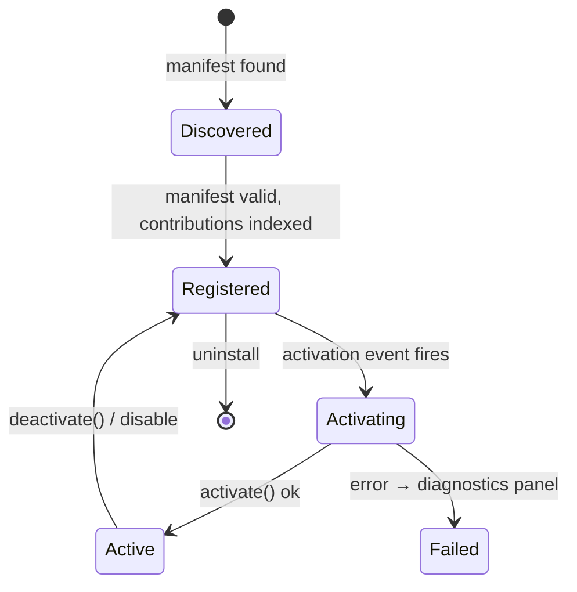

# Extension System

Crates: `ext-api` (the contract), `ext-host` (the implementation). The user-facing guide is [[Writing an Extension]].

## Principles
1. **No privileged path.** Built-in editors are static extensions using only `ext-api`. If they need something the API lacks, the API grows.
2. **Declarative first.** Manifests describe panels, commands, languages, keybindings, themes and renderers so the shell can build UI *before* activating code. Activation is lazy.
3. **Capabilities are explicit.** The manifest requests; the user grants; the `Host` checks on every call. Static extensions are checked too.
4. **Two runtimes, one API.** Static (Rust crate, linked in, full Dioxus) and WASM component (sandboxed, portable). See [[ADR-0004 WASM components for extensions]].

## Lifecycle

Contributions (panels, commands, …) are available in the **Registered** state — a command can appear in the palette for an extension that has never run; running it triggers activation.

## Runtimes by platform

| | static | wasmtime | browser |
|---|---|---|---|
| desktop | ✅ | ✅ | — |
| web | ✅ | — | ✅ (Worker + `wasm_component_layer`) |
| mobile | ✅ | ❌ (v1) | — |
| server | ✅ | ✅ | — |

WASM panels render through a small retained-mode `ui::Tree` (rows, columns, text, inputs, lists, tables, `Embed(view)`), diffed and rendered by the shell. It is less expressive than Dioxus on purpose: portable, sandboxable, and cheap over a Worker boundary. Static extensions may return real `Element`s.

## The WIT world
`ext-api`'s Rust types are the source of truth; `wit/moonkale.wit` is *generated* from them so the two can't drift. Extension authors in Rust use `moonkale-ext-api` directly and compile with `cargo component`; other languages use the WIT.

## Hot topics
- **Hot reload** of a wasm component during development (watch `.wasm`, re-instantiate, replay activation) — wanted, not designed.
- **Renderer contributions** must stay declarative for wasm extensions (colours, glyphs, popup templates) because the GPU renderer batches them; custom wgpu passes are static-only.
- **Conflicts** (two extensions, one command id) are reported, not resolved.
