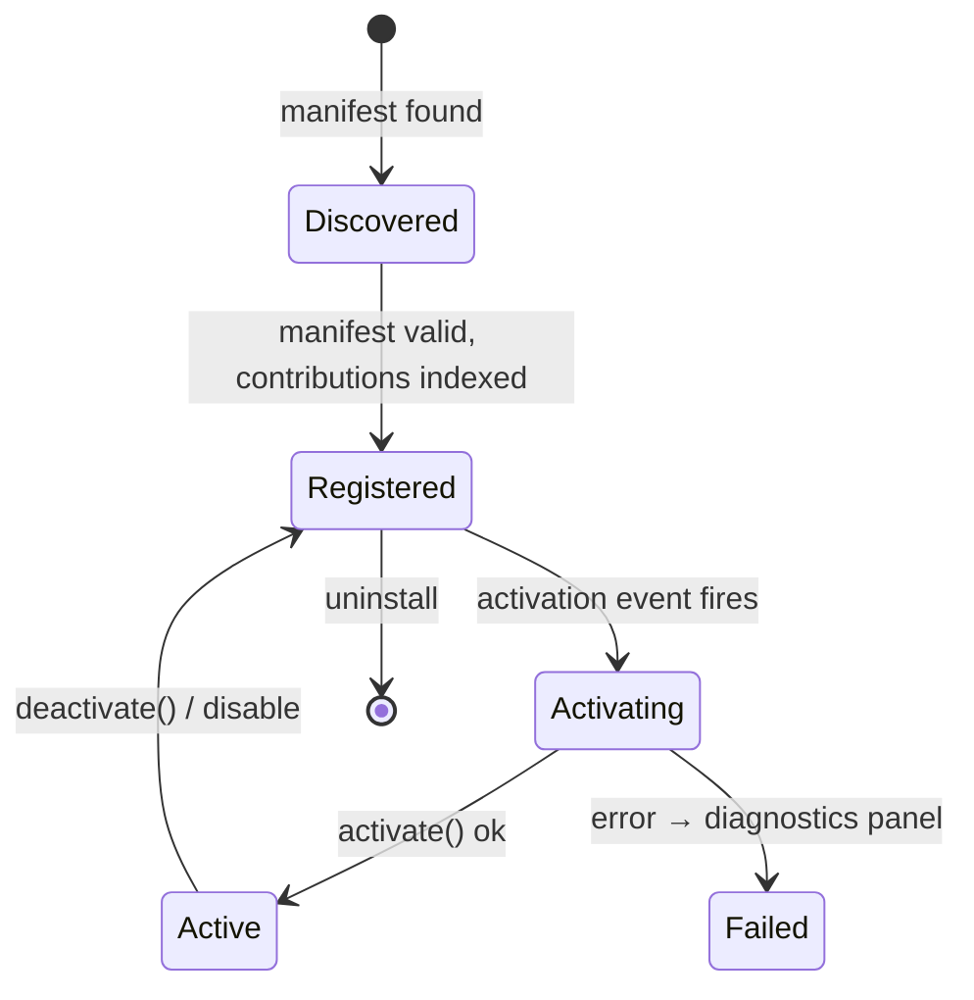

Crates: `ext-api` (the contract), `ext-host` (the implementation). The user-facing guide is [[Writing an Extension]].

> [!note] As built (2026-10-01) — read this before the principles
> - **Static extensions** implement `moonkale_ext_api::Extension`: `manifest()` (a Rust `Manifest { id, name, description, optional, default_enabled, permissions }`), `panels()`, `render()`, `on_panel_closed()`, `commands()`/`run_command()`, `claims()` (which documents it is the editor of, and how strongly — Milestone 18), `flow_libraries()`, `settings()`. They are listed in `moonkale_shell::default_extensions()`, enabled per tier in the Extensions panel. Since Milestone 18 an extension can also put **file marks** on Explorer rows and tabs (`Workspace::contrib.file_marks`, git's status letters), and the platform hands the workspace its services in five groups (`WorkspaceConfig { folders, processes, persistence, network, runtimes }`).
> - **Wasm extensions** use the JSON ABI v1 ([[ADR-0013 JSON ABI before components]]): commands and agent tools only.
> - **Not built**: the `moonkale.toml` manifest, the lifecycle below (every static extension is constructed at start; there is no lazy activation), activation events, `when` clauses, the `Host` handle with `kv_get`/`notify`/`ask`, `moonkale_shell::Tree` panels, WIT, contribution points other than panels, commands, settings and flow libraries. Those parts of this page, [[Contribution Points]], [[Manifest Reference]] and [[Host API Reference]] are the **target design**.

## Principles
1. **No privileged path.** Built-in editors are static extensions using only `ext-api`. If they need something the API lacks, the API grows.
2. **Declarative first.** Manifests describe panels, commands, languages, keybindings, themes and renderers so the shell can build UI *before* activating code. Activation is lazy.
3. **Capabilities are explicit.** The manifest requests; the user grants; the `Host` checks on every call. Static extensions are checked too.
4. **Two runtimes, one API.** Static (Rust crate, linked in, full Dioxus) and WASM component (sandboxed, portable). See [[ADR-0004 WASM components for extensions]].

## Lifecycle

```mermaid
stateDiagram-v2
  [*] --> Discovered: manifest found
  Discovered --> Registered: manifest valid, contributions indexed
  Registered --> Activating: activation event fires
  Activating --> Active: activate() ok
  Activating --> Failed: error → diagnostics panel
  Active --> Registered: deactivate() / disable
  Registered --> [*]: uninstall
```

Contributions (panels, commands, …) are available in the **Registered** state — a command can appear in the palette for an extension that has never run; running it triggers activation.

## Catalogue
What exists and what is planned, with tiers and platform fit: [[Extension Catalogue]] — keep it current when an extension is added, moved or retiered.

## Runtimes by platform

| | static | wasmtime | browser |
|---|---|---|---|
| desktop | ✅ | ✅ | — |
| web | ✅ | — | ✅ (Worker + `wasm_component_layer`) |
| mobile | ✅ | ❌ (JIT; `wasmi` would fit) | planned: the same Worker runtime inside the WebView, see [[Android Extensions and Bundling]] |
| server | ✅ | ✅ | — |

> [!note] Status after Milestone 6 ([[Milestone 6 - Implementation Log]])
> **Milestone 8:** the **browser** runtime exists for the JSON ABI: `packages/js/wasm-host` runs the module in a Worker and serves its synchronous `call` import through a `SharedArrayBuffer` mailbox that the main thread (the client `Workspace`) answers with the same three host calls and permission check; the server sends COOP/COEP so the page is cross-origin isolated; `/api/ext/module/{id}` serves the bytes. The server runtime remains the fallback and the only runtime on desktop.
>
> **Static** extensions are the catalog in `moonkale_shell::default_extensions()`; each `Manifest` is `core` / `optional` / `opt_in` with declared permissions, and `Settings.extensions` (user ← workspace) decides what is enabled and granted — *Settings → Extensions*. **wasmtime** runs on desktop and on the web server (`moonkale-ext-host`, feature `wasmtime`) with a **JSON ABI v1 over core wasm modules** — exports `alloc` / `manifest` / `run`, imports `moonkale.log` / `moonkale.call` (`list_sources`, `query`, `fetch_text`), permissions checked per call — instead of the component model described below, which stays the target (the manifest shape is the same). Modules are discovered in `~/.config/moonkale/extensions/` and `<folder>/.moonkale/extensions/`; their `llm_tool` commands become agent tools (policy `Mutating`). The **browser** runtime and the `moonkale_shell::Tree` panels are not built yet: wasm extensions contribute commands, not panels, in v1. Example: `packages/extensions/wordcount`.

WASM panels render through a small retained-mode `moonkale_shell::Tree` (rows, columns, text, inputs, lists, tables, `Embed(view)`), diffed and rendered by the shell. It is less expressive than Dioxus on purpose: portable, sandboxable, and cheap over a Worker boundary. Static extensions may return real `Element`s.

## The WIT world
`ext-api`'s Rust types are the source of truth; `wit/moonkale.wit` is *generated* from them so the two can't drift. Extension authors in Rust use `moonkale-ext-api` directly and compile with `cargo component`; other languages use the WIT.

## Hot topics
- **Hot reload** of a wasm component during development (watch `.wasm`, re-instantiate, replay activation) — wanted, not designed.
- **Renderer contributions** must stay declarative for wasm extensions (colours, glyphs, popup templates) because the GPU renderer batches them; custom wgpu passes are static-only.
- **Conflicts** (two extensions, one command id) are reported, not resolved.
