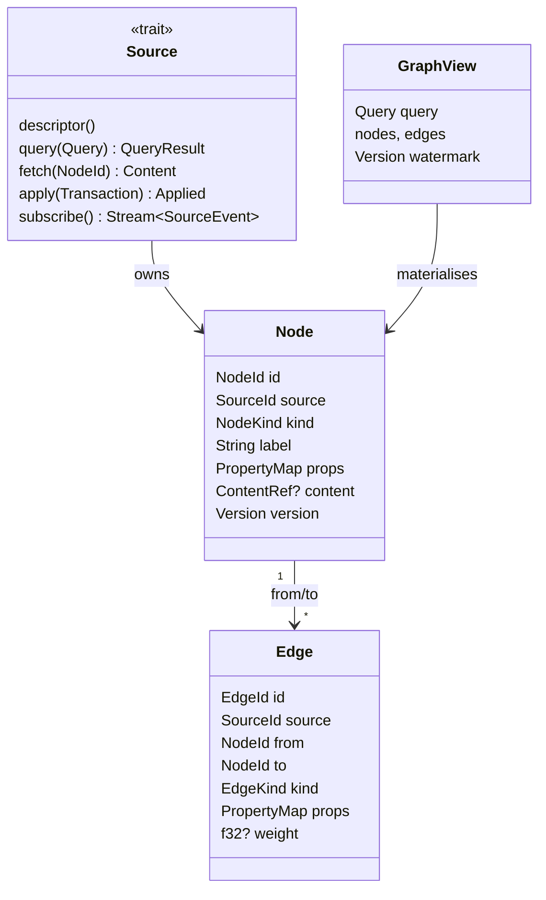

Crate: `packages/core`. The model is the contract between sources, editors, the index, extensions and agents.

## Entities

### Design choices

**Open enums for kinds.** `NodeKind` and `EdgeKind` have well-known variants editors can match on (`File`, `Row`, `Vertex`, `Page`, `Symbol`, `Block`; `Contains`, `References`, `Links`, `ForeignKey`) plus `Custom(ExtensionId, String)`. Extensions add kinds without touching `core`; editors advertise which kinds they open ([[Contribution Points]]).

**Content is a reference, not bytes.** `ContentRef::{Text, Blob, Rows, Nested}` describes shape and size; `Source::fetch` gets the body. This is what makes "open a 10 GB folder" or "open a billion-row table" an *open*, not a *load*. It also mirrors the old README's "discourage very large files".

**Deterministic ids for sourced entities.** A file's `NodeId` is derived from `(SourceId, relative path)`; a row's from `(SourceId, table, primary key)`. Re-opening yields the same ids with no lookup table, so saved layouts, links and agent citations survive restarts.

**Views, not vectors.** Editors hold a `GraphView` = query + materialised subgraph + version watermark. Refresh is "re-run the query"; incremental update is "apply events above the watermark". The graph editor, the table editor and an LLM tool call all return `GraphView`s — "display a subgraph" is just "run a narrower query".

**Two query levels.** A structured `Query` IR every source must support (listing, neighbourhoods, paging, search) so every editor works with every source; and `TextQuery { dialect, text }` for raw SQL/Cypher/TypeQL. Results from text queries are *lifted* into nodes/edges using rules the source provides ([[Data Sources]]).

**Writes are transactions of ops with expected versions.** Optimistic concurrency, undo/redo by replay, partial success with `Unsupported` reasons. Text edits are patches ([[ADR-0009 Patches not snapshots]]).

**Cross-source edges** are owned by the source that stores them; the target may be foreign. This enables "wiki page links to a database row" and is the trickiest consistency problem in the project — see [[Problem Ranking]] (P-24).

## What the model is *not*
- Not a database. Nothing is persisted by `core`; sources and the index persist.
- Not a CRDT. Versions + patches leave the door open ([[ADR-0009 Patches not snapshots]]).
- Not typed beyond kinds. Schema (TypeDB types, SQL columns) is exposed as a *schema graph* in `SourceDescriptor`, not enforced by `core`.

## Worked example: a Rust crate in a folder

| Thing | Node kind | Edge to parent |
|---|---|---|
| `src/` | `Directory` | `Contains` from crate root |
| `src/main.rs` | `File{Text, lang: rust}` | `Contains` |
| `fn main` | `Symbol` (from index) | `Defines` from file |
| `App` used in `main` | — | `References` from `main` symbol to `App` symbol |
| `docs/arch.md` with `[[main.rs]]` | `Page` | `Links` from page to file |
| a `users` table in Postgres | `Table` | `Contains` from schema |
| the page also says `[[users]]` | — | `Links` page → table (cross-source) |

All of that is one graph; the [[Graph View]] draws it, the [[Table Editor]] pages through `users`, and an agent can walk from the doc to the code to the data.
