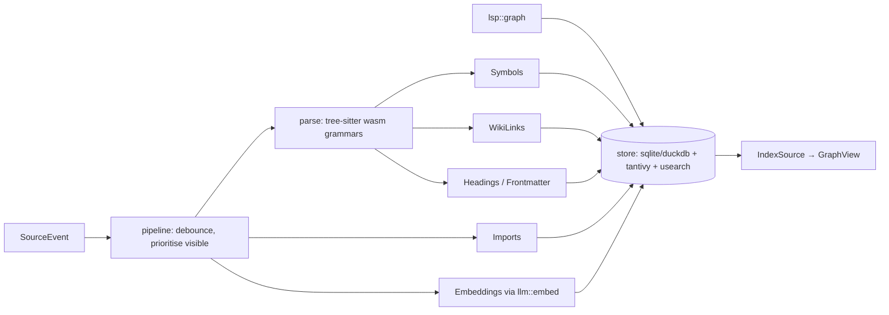

Crate: `index`. The index turns *files and rows* into a *graph* by deriving what sources don't know: symbols, links, outlines, embeddings, stack frames. It is exposed as `IndexSource`, so its output is just more nodes and edges.

## Decisions
- **tree-sitter grammars as `.wasm`** — one artefact for desktop, web and mobile; contributed by language extensions ([[Contribution Points]]).
- **Two symbol extractors**: tree-sitter (fast, always available, approximate) and LSP (precise, needs a server). Derived edges carry `precision`; views prefer LSP when both exist.
- **Incremental by node**: a change re-runs extractors for that node only and re-links only its edges. Priority goes to nodes that are visible in some editor.
- **Storage is native/server**: `tantivy` + `usearch` don't target the browser; the web build queries the server's index. Parsing still runs client-side for highlighting.
- **`recoco`** (Rust-only CocoIndex fork) is a candidate for the pipeline layer; evaluate before hand-rolling scheduling.

## Stack traces and ASTs
`index::trace` parses rustc/Julia/Go/Python trace formats into `Frame` nodes with `Calls` edges, linked to `Symbol` nodes. A panic in the [[Terminal]] becomes a clickable subgraph in the [[Graph View]] with a hierarchical layout. Function ASTs are the tree-sitter tree exposed as a `GraphView` (nodes = syntax nodes) — free once parsing exists.

## Embeddings and RAG
See [[LLM and RAG]]. Chunking is per symbol / heading / row; vectors are stored locally (`usearch`) or in the source when it has `VECTOR` (`pgvector`, HelixDB). Hybrid search = BM25 (`tantivy`) ∪ vector, fused.
