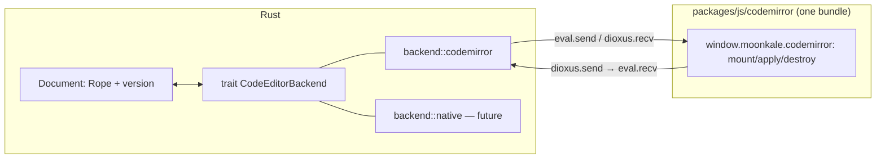

The brief allows TypeScript packages (CodeMirror, Milkdown) but wants them **modular and replaceable** by Rust. This note is the mechanism; the principle is [[ADR-0002 Rust first, TypeScript behind traits]] and [[ADR-0008 Rust owns the document, JS is a view]].

## The shape

Same shape for `milkdown` ↔ `RichTextBackend` and `xterm` ↔ `TerminalBackend`.

## Rules (also in `packages/js/README.md`)
1. One TS dependency per folder; **no folder imports another**; each builds to one self-contained ESM file loaded via `asset!()`.
2. JS holds **no application state**. The rope/AST/session lives in Rust; JS receives text + decorations and emits edits.
3. JS contains **no language knowledge**. Highlighting, folding, link resolution, LSP data arrive from Rust as decorations. This keeps the bundles small and means a Rust backend needs *nothing* from the JS one.
4. Every message is documented in the package's `PROTOCOL.md`. That file is the acceptance test for a Rust replacement.
5. Replacement = flip the crate feature (`backend-codemirror` → `backend-native`), delete the folder.

## Transport
`document::eval` (Dioxus, renderer-agnostic — works in browser, WebView2, WKWebView, WebKitGTK, and the mobile webviews). **As built in Milestone 1**: one eval per mounted editor; JS → Rust with `dioxus.send(value)`, Rust → JS with `eval.send(value)` / `await dioxus.recv()` — Dioxus's own channel, no `CustomEvent`s and no global listeners. The initial text is sent over the channel, never formatted into the script. See `packages/js/codemirror/PROTOCOL.md` and `packages/editors/code/editor-code.md`. Binary (terminal output) will use base64 initially; a `SharedArrayBuffer` path is an optimisation.

## Cost we accept
Latency of a JSON hop per keystroke. CodeMirror applies the edit locally first (optimistic) and Rust reconciles; conflicts are rare (single user) and resolved by Rust re-sending the canonical text. This is the same trade Zed's remote mode and VS Code's extension host make.

## The long-term direction
Once all three backends have Rust replacements ([[Rust-native Editor Candidates]]), the desktop app no longer needs a JS engine at all and could move from a webview to `dioxus-native` (Blitz, wgpu-rendered). That would also dissolve the [[Graph View]]'s hardest platform problem (the surface inside a webview). The JS dependencies are, literally, what keeps us in a webview — which is the strongest argument for keeping them replaceable.
