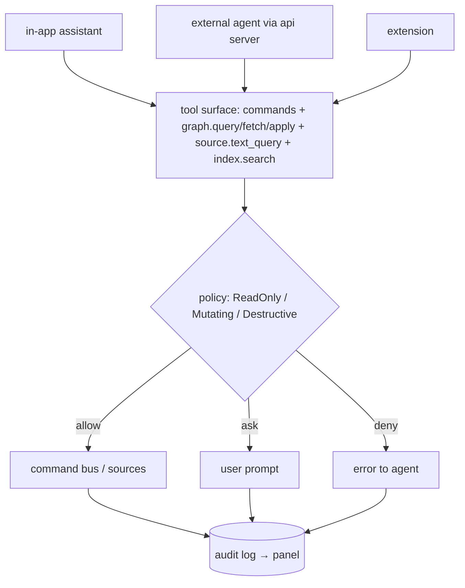

# LLM and RAG

Crate: `llm`. Premise from the brief: *LLMs are querying the opened projects, running SQL/Cypher, and requesting embeddings.* Design premise here: **an LLM is a user**, with the same doors and one extra gate.

## Tool surface
- Every command with an `ArgSchema` and `llm_tool = true` ([[Contribution Points]]) becomes a tool — extensions get agent integration for free.
- Built-ins: `graph.query`, `graph.fetch`, `graph.apply`, `source.text_query{dialect,text}`, `index.search` (hybrid), `editor.open`, `workspace.list_sources`.
- Results are `GraphView`s serialised **ids + labels first, content on request** — keeps context windows small and lets the agent drill down.

## Policy
Statement classification comes from the sources (`sources-sql::text` classifies SQL; graph dialects likewise). Defaults: reads allowed; writes ask; destructive (`DROP`, `DELETE` without `WHERE`, schema changes, `rm -rf` in terminal tools) always ask. Row/byte caps per call. Per-source and per-agent overrides in workspace policy.

## Embeddings
`llm::embed` batches, caches by content hash, and tags vectors with model+version so `index::embed` knows when they're stale. Local models are just another `Provider` (Ollama-style HTTP). Storage: `usearch` locally; `pgvector`/HelixDB/LanceDB when a source has `VECTOR`.

## Transcripts are nodes
Conversations are stored as `Page`-like nodes with `Links` to everything cited. They become part of the knowledge graph — linkable from a wiki page, searchable, and visible in the graph view.

## External agents
`api` exposes the tool surface to external agents (Claude Code, IDE agents). Whether to speak MCP or a native protocol is an open decision; MCP is the pragmatic default for reach. Recorded in [[Problem Log]] when it's decided.

## Platform
Providers are HTTP → all platforms. Web/mobile route through `api` so keys never reach the client.
