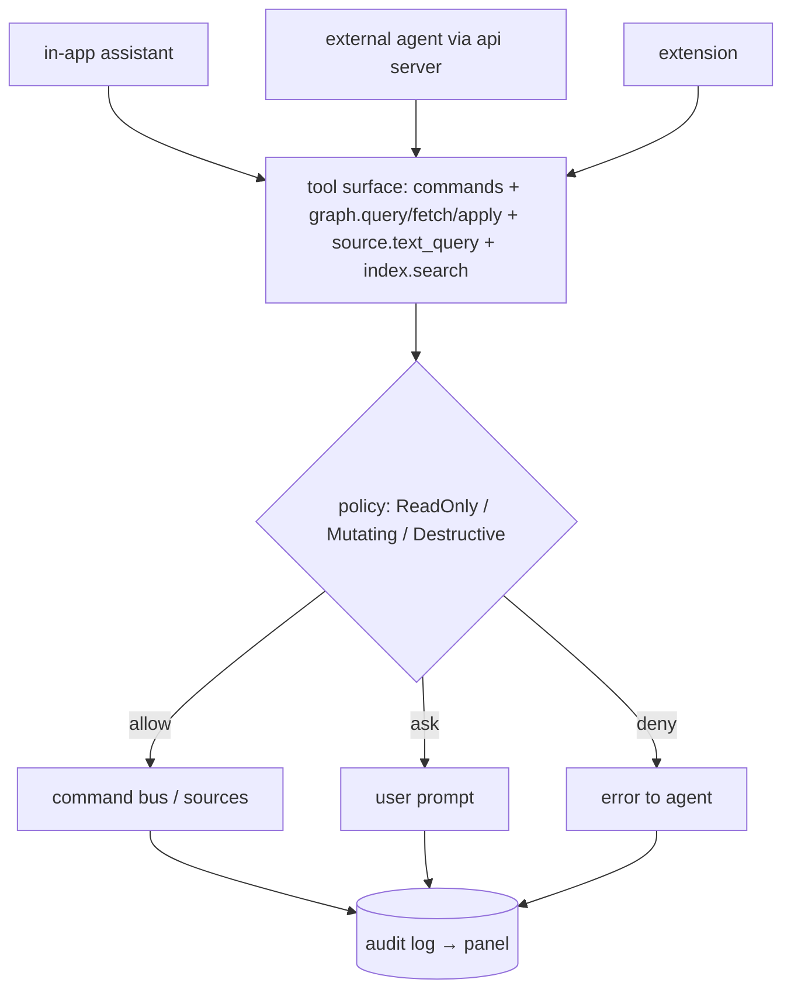

Crate: `llm`. Premise from the brief: *LLMs are querying the opened projects, running SQL/Cypher, and requesting embeddings.* Design premise here: **an LLM is a user**, with the same doors and one extra gate.

```mermaid
flowchart TB
  A1[in-app assistant] & A2[external agent via api server] & A3[extension] --> TOOLS
  TOOLS[tool surface: commands + graph.query/fetch/apply + source.text_query + index.search]
  TOOLS --> POL{policy: ReadOnly / Mutating / Destructive}
  POL -->|allow| BUS[command bus / sources]
  POL -->|ask| USER[user prompt]
  POL -->|deny| ERR[error to agent]
  BUS & USER & ERR --> AUD[(audit log → panel)]
```

## Tool surface
- Every command with an `ArgSchema` and `llm_tool = true` ([[Contribution Points]]) becomes a tool — extensions get agent integration for free.
- Built-ins: `graph.query`, `graph.fetch`, `graph.apply`, `source.text_query{dialect,text}`, `index.search` (hybrid), `editor.open`, `workspace.list_sources`. *As built* (`llm/src/tools.rs`): `workspace.list_sources`, `graph.query`, `graph.fetch`, `source.text_query`, `index.search`, `editor.open`, `editor.replace`, `file.create`, `terminal.run` — no `graph.apply`; commands contributed by static extensions are **not** tools (only wasm modules' `llm_tool` commands are).
- Results are `GraphView`s serialised **ids + labels first, content on request** — keeps context windows small and lets the agent drill down.

## Policy
Statement classification comes from the sources: since Milestone 18 the agent asks the target source (`Source::classify` through `ToolHost::classify`), whose default is the shared SQL and Cypher rules in `moonkale_core::source::risk`. Defaults: reads allowed; writes ask; destructive (`DROP`, `DELETE` without `WHERE`, schema changes, `rm -rf` in terminal tools) always ask. Row/byte caps per call. Per-source and per-agent overrides in workspace policy.

## Embeddings
*As built*: embeddings come from the default agent's provider (OpenAI-compatible `/embeddings`), are kept in memory per chunk and compared by brute-force cosine; nothing is cached across opens ([[Indexing]], [[Internal State]]).

`llm::embed` batches, caches by content hash, and tags vectors with model+version so `index::embed` knows when they're stale. Local models are just another `Provider` (Ollama-style HTTP). Storage: `usearch` locally; `pgvector`/HelixDB/LanceDB when a source has `VECTOR`.

## Transcripts are nodes
Conversations are stored as `Page`-like nodes with `Links` to everything cited. They become part of the knowledge graph — linkable from a wiki page, searchable, and visible in the graph view.

## External agents
`api` exposes the tool surface to external agents (Claude Code, IDE agents). **Decided in Milestone 5: MCP** — `server/src/mcp.rs` serves the tool surface at `/mcp` with its own bearer (`MOONKALE_MCP_TOKEN`).

**Claude Code specifically** — both directions (Moonkale as its IDE; Claude Code as a Moonkale agent provider on a subscription, no API key): [[Claude Code Extension]] (plan).

## Saved agents and sessions (Milestone 15)
Several language-model profiles live in settings (*Default* is the flat `llm` block, more under `agents[]`), one is the default, every session in the Agent panel picks one; sessions run side by side and are saved in the folder. Detail: [[Agent Sessions and Profiles]].

## Platform
Providers are HTTP → all platforms. Web/mobile route through `api` so keys never reach the client.
