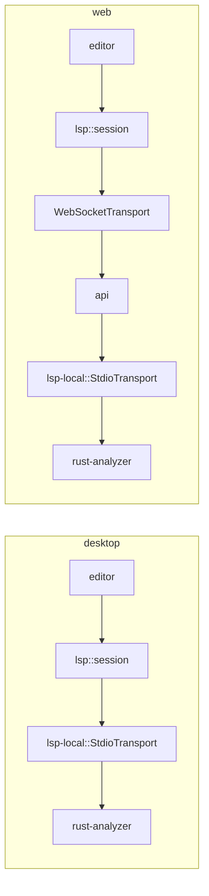

# LSP and Terminal

Both follow the same split: a **protocol/session crate that runs everywhere** and a **platform crate that owns the process**.

| | everywhere | desktop / server only |
|---|---|---|
| Language servers | `lsp` (session, sync, features, graph extractor) | `lsp-local` (stdio spawn, discovery, supervision) |
| Terminals | `terminal` (session, VT grid, link detection) | `terminal-pty` (`portable-pty`) |

## LSP
- Transport is a trait; the session never knows if the server is local or remote.
- Neutral feature types: the code editor backend (CodeMirror or native) never sees `lsp-types`.
- `lsp::graph` is a second symbol extractor feeding [[Indexing]] with `precision: Lsp`.
- Nodes from databases get `moonkale://` URIs; most servers ignore them, which is fine — LSP is for folder-backed code.
- Servers per language ([[Code Editor]]): `rust-analyzer`, `LanguageServer.jl`, `gopls`, `ucm` (Unison), `lake serve` (Lean).

## Terminal
- `alacritty_terminal` maintains the VT grid **even when xterm.js renders**, cheaply, because the grid is what link detection and search read.
- Links: `path:line:col`, URLs, rustc/Julia/Go error formats → nodes; a compiler error is one click from the code, and a stack trace can be opened as a graph ([[Indexing]]).
- Remote sessions for web/mobile run PTYs inside `api` — see the security list in [[Platform Matrix]].

## Shared open problem
Remote LSP + remote terminal make `api` a code-execution service. Auth, jail, limits, allow-list, audit — before either ships. [[Problem Ranking]] P-15.
