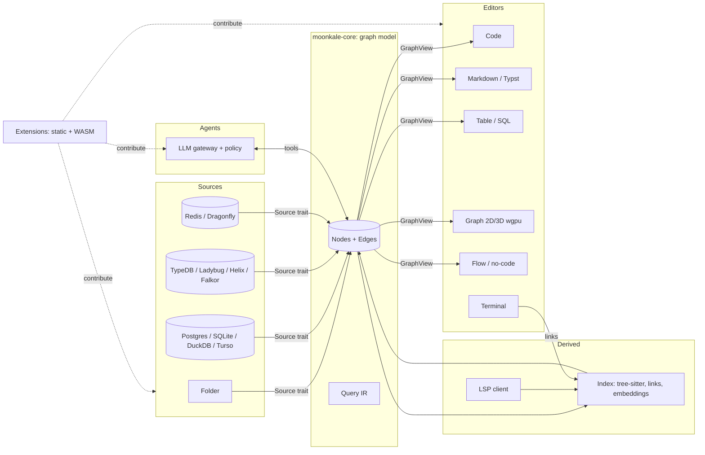
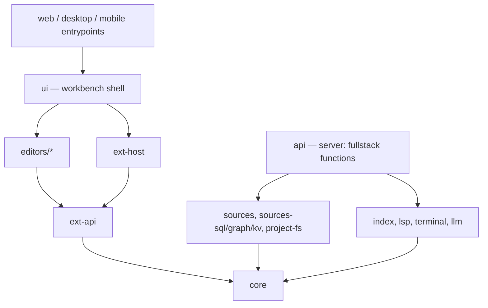

# Overview

Moonkale unifies code editing and knowledge editing around one idea: **everything you open becomes a graph**, and every editor is a view on that graph.

## The three bets

1. **Graph-native model** ([[Graph-Native Model]]). A folder, a Postgres schema and an Obsidian vault are all nodes and edges. This is what lets one graph view show a Rust crate next to a database next to a wiki, and what gives LLM agents a single traversal surface.
2. **Extension-driven** ([[Extension System]]). The built-in editors are extensions with no privileged access. If the API can't express the code editor, the API is wrong.
3. **Rust everywhere, GPU where it matters** ([[ADR-0002 Rust first, TypeScript behind traits]], [[ADR-0003 wgpu for graph rendering]]). One language across desktop/web/mobile via Dioxus; the graph view is `wgpu` so it stays fluid where DOM-based tools (Obsidian, Cytoscape) fall over.

## Layers

Dependency direction is strictly downward. `core` depends on nothing. See [[Project Structure]] for every crate.

## What this replaces

The earlier plan ([[old/rough goal]]) was Deno + Vite + Lumino on the frontend and Tauri + Rust on the backend. [[ADR-0001 Dioxus instead of Lumino and Tauri]] explains the move to a single Rust codebase with Dioxus 0.7 and why the TypeScript pieces that survive (CodeMirror, Milkdown, xterm) are quarantined behind traits ([[JS Interop Boundary]]).
