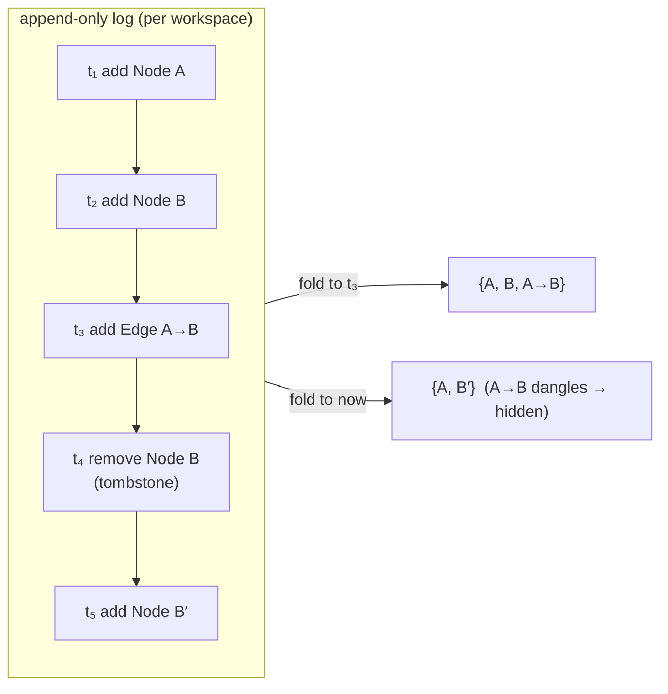

Moonkale has to answer "what did this look like yesterday, and who changed it?" for two very different kinds of thing: **files in a folder**, which the world already versions with git, and **nodes and edges in the graph**, which git cannot see. This note is the overview; the decision is [[ADR-0012 Two histories]]; prior art is in [[Versioning Prior Art]].

## The two models, side by side

| | git (files) | entity log (graph) |
|---|---|---|
| unit of change | a **diff** of bytes/lines between two snapshots of a file | an **event**: *this node/edge (by UUID) was added / removed* at a timestamp |
| identity | a path (renames are heuristics) | a stable UUID — a node can move, be relabelled, change source, and stay the same node |
| history shape | DAG of commits, each a full-tree snapshot | append-only log of events; state = fold over the log |
| "current state" | the working tree | the set of entities whose latest event is *add* |
| time travel | `git checkout <sha>` | *replay the log up to t* — cheap, no checkout, per-node |
| deletion | the line is gone from the diff | a **tombstone** event; the UUID and its past stay |
| merging | 3-way text merge, conflicts are textual | add/remove of distinct UUIDs commute — concurrent edits merge *without conflicts* (add-wins or remove-wins is a policy choice) |
| what it can't do | know that a row and a wiki page are "the same thing" across renames; version a database | diff prose or code *inside* a node — that still needs a text diff / CRDT |

Git tracks *what the text became*; the entity log tracks *what exists and since when*. Neither replaces the other; both are needed, and the seam between them is the interesting part.

## The entity log



An event is small and self-contained:

```text
Event {
  id:        EventId (UUID v7 — time-ordered, so the log sorts itself),
  at:        Timestamp (wall clock) + optional logical clock per replica,
  actor:     ActorId (user, agent, extension, or a source's importer),
  kind:      Add(Entity) | Remove(EntityId) | SetProps(EntityId, delta) | Content(NodeId, PatchId),
  cause:     Option<EventId>   (what this event responds to — undo, merge, import),
  tx:        TransactionId     (events applied atomically together),
}
```

Properties of this design that matter for Moonkale:

1. **UUIDs make identity independent of location.** A file renamed in git is a new path; in the graph it is the same node with a `SetProps(native_key)` event. Wiki-links, agent citations and saved layouts survive renames.
2. **Deletion is a tombstone, never a hole.** "Why is this edge gone?" has an answer with a timestamp and an actor. Undo of a delete is an *add* that `cause`s the tombstone — no special-casing.
3. **Time travel is a filter, not a checkout.** "Show me the graph as it was before the agent ran" is `fold(log.filter(at ≤ t))`, and it works per subgraph, so the [[Graph View]] can scrub a timeline.
4. **Merging is set arithmetic.** Two replicas adding different nodes never conflict. The only real conflict class is *content* (two edits to the same text) — which is exactly the part delegated to text patches / a CRDT ([[ADR-0009 Patches not snapshots]]).
5. **Snapshots are an optimisation.** Periodic materialised states keep folds cheap; the log remains the truth.
6. **Agents are first-class actors.** Every tool call that mutates the graph is an event with `actor = agent:<id>`, which makes the [[LLM and RAG]] audit log and the version history *the same log*.

### How it maps onto what exists today
- `core::Version` is a per-node change marker for optimistic concurrency. In the log model it becomes *the id of the last event that touched the node* — the same thing, now with history behind it.
- `core::Transaction { ops }` is already an event batch; `Op::WriteText` is a `Content` event. The log is the persistence of transactions plus the `Add/Remove` ops the model does not have yet (listed as design stubs in `core/src/graph/history.rs`).
- Sources that *cannot* keep history (a plain folder, a live Postgres table) still produce events: the index diffs the source's current state against the last known state and emits `Add/Remove` events on the source's behalf — the importer is the actor.

## Git, and what to do with it

For **folder sources**, git is the truth about text history and must be respected, not replaced:

- **Status and diff decorations** in the Explorer and editor gutters (modified/added/untracked, hunks).
- **Commit, branch, stash, log** — an extension (`packages/vcs-git`, not started) over `gix` (pure Rust, `0.87`) with `git2` (libgit2) as fallback where gitoxide lacks a feature. Neither compiles to wasm: on web the server runs git ([[ADR-0005 Server functions as the remote backend]]).
- **History as a graph.** Commits are nodes, parent links are edges, files-touched are edges to `File` nodes — the graph view renders `git log --graph` natively, and an agent can walk from a bug report to the commit to the function. This is the same trick as the schema graph in [[Data Sources]].
- **Bridging the two histories.** When a file is saved, the entity log records a `Content(node, patch)` event; when the user commits, the commit's SHA is recorded as a *checkpoint* event referencing the events since the last commit. Time travel across a commit boundary then works in both directions: from a commit to the graph state at that moment, and from a graph event to the commit that captured it.

Non-git folder history (a plain directory, no repo) still gets the entity log — with content patches, so undo/redo and "what changed today" work even before `git init`.

## Databases

SQL and graph databases have their own transaction/MVCC machinery and rarely expose history. Moonkale does not try to version their contents; it versions **what it saw**: the importer emits `Add/Remove/SetProps` events as rows appear, change and vanish, so the user gets history *of their view of the data* — good enough for "what did the agent change" and "when did this row disappear", and honest about what it is. Databases with real history (TerminusDB, Dolt, XTDB — see [[Versioning Prior Art]]) can map their history onto the log directly when a source is written for them.

## What this costs
- The log grows without bound → snapshots + compaction of tombstones older than a retention window (never compact events that a checkpoint references).
- Every mutation path must go through the log — no side doors. Sources that write to disk/database *and* append to the log must do so atomically or replay on restart.
- Per-replica logical clocks and actor ids are needed the moment two devices sync; designed in now, implemented later (P-30/P-33 in [[Problem Ranking]]).

## Where it lives (planned)
| piece | crate | status |
|---|---|---|
| `Event`, `EntityLog`, fold, `text_at` (replay), JSONL | `core::graph::history` | **built in Milestone 8**; snapshots/compaction next |
| log storage (SQLite/DuckDB file per workspace) | `index::store` | design |
| status/diff, stage/commit, history-as-graph | `extensions/git` (`moonkale-ext-git`; CLI on desktop and the web server) | **built in Milestone 7** ([[Milestone 7 - Implementation Log]]) — checkpoints ↔ commits wait for the entity log |
| timeline scrubbing UI | `editors/graph` + a "History" panel in `ui` | design |
