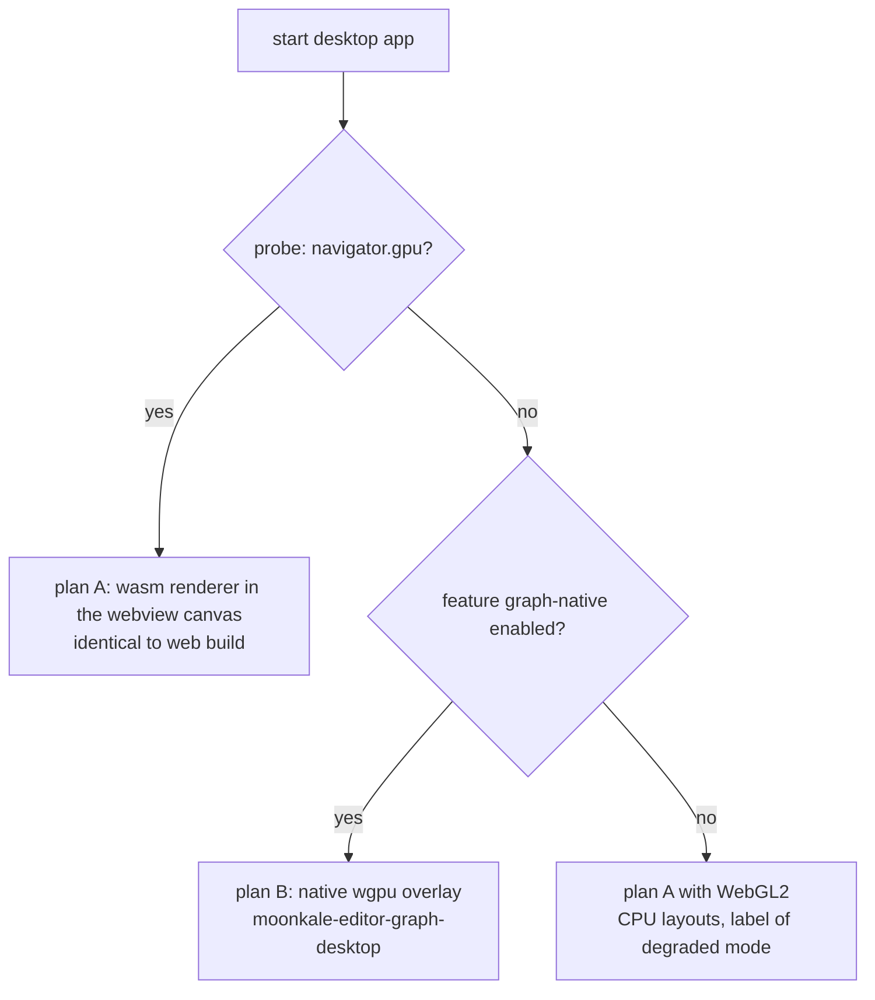

# ADR-0011 — Desktop graph surface strategy

**Status:** proposed (decide after measurements in [[P-001 Graph surface in desktop webview]]) · Extends [[ADR-0003 wgpu for graph rendering]]

## Context
The graph renderer is `wgpu`. On desktop the UI lives in a system webview. WebView2 and WKWebView expose WebGPU; WebKitGTK (Linux) does not by default ([[Linux Desktop Setup]]). A WebGL2 fallback works everywhere but has no compute shaders, so GPU force layouts — the feature that makes 100k nodes fluid — are unavailable there. The brief explicitly allows a **different implementation for desktop**.

## Decision (proposed)
Ship **both**, chosen at runtime:

- **Plan A** — the web code path inside the webview. One renderer, one set of bugs. Default when WebGPU is present.
- **Plan B** — `moonkale-editor-graph-desktop`, a desktop-only crate ([[Project Structure]] rule: single-platform feature → separate crate). A native `wgpu` surface as a GTK sibling widget (Linux) / child view (others), positioned over a placeholder `
` in the panel; the *editor* (scene, layout, interaction, style) is shared and unchanged — only `SurfaceProvider` differs.
- The choice is visible to the user (Diagnostics panel, `graphSurface` context key) so bug reports say which path they hit.

## Why not always plan B on desktop
Z-order: webview-drawn popups/menus/tooltips render *under* a native overlay. Plan B must draw its own popups on the surface (or cut holes). That is real work and a second UI style; only pay it where plan A can't run.

## Why not `dioxus-native` (Blitz)
It would make this trivial but has no JS engine, so CodeMirror/Milkdown/xterm can't run — blocked until [[Rust-native Editor Candidates]] land. Long-term answer, not a Phase-2 one.

## Consequences
- Two surfaces to test on Linux; CI needs a WebKitGTK job *and* a Vulkan (lavapipe) job.
- Input routing and HiDPI for the overlay are new code (`graph-desktop/src/{input,sync}.rs`).
- Measurements required before acceptance: fps and layout time at 10k/50k/100k on (a) WebKitGTK with WebGPU flag on, (b) WebGL2, (c) native overlay; on both NVIDIA and AMD GPUs of the dev box.
