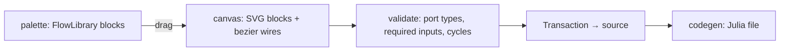

Crate: `editors/flow`. Drag-and-drop blocks wired by typed ports. First target from the brief: **build Lux.jl models by drag and drop**; then ModelingToolkit.jl acausal components.

## Model
A flow is ordinary graph data: `Block` nodes, `Custom("flow.wire")` edges, port info in properties. It lives in any source (a folder as `.flow.json`, or rows in a database) and is visible in the [[Graph View]]. The flow editor adds what a generic graph view can't: a **schema** (block kinds with typed ports), snapping, validation and a palette.

## Block libraries are contributions
`FlowLibrary { blocks: Vec<BlockKind>, codegen }` from an extension. Lux.jl library: `Dense`, `Conv`, `Chain`, `Parallel`, activations, loss, optimiser; port types carry tensor shapes with a small unification so a shape mismatch is a red wire. MTK library: components with physical-unit ports and `connect` semantics.

## Codegen is a command
`flow.generate` produces files (`model.jl` with a `Chain(...)` and a training scaffold; MTK: `@named` components + `connect` equations). Being a command, it's also an LLM tool ([[LLM and RAG]]) — "wire a CNN for MNIST" becomes a transaction on the flow graph plus a codegen call.

## Rendering
SVG/Dioxus for typical flows (blocks need rich editable content: parameter fields, previews). Very large flows can fall back to the graph renderer's surface later.

## Phases
1. Canvas, palette, wires, validation, save/load as nodes.
2. Lux.jl library + codegen; run via [[Terminal]] (`julia model.jl`) with errors linked back to blocks.
3. MTK library.
4. Execute-in-place (Julia kernel) — research.
