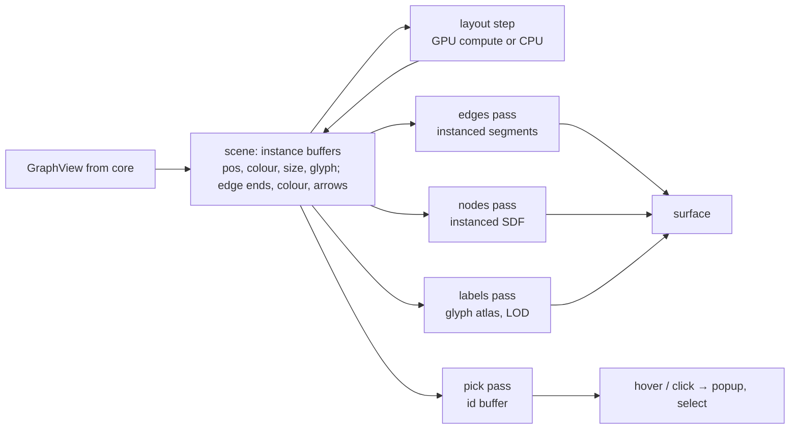

Crate: `editors/graph`. The requirement that shapes it: **fluid at 100k+ nodes** — the brief calls out that Obsidian's graph becomes slow past a certain size. See [[Graph Rendering Options]] for the option survey and [[ADR-0003 wgpu for graph rendering]] for the decision.

## Pipeline

## Requirements → mechanisms
| Requirement (from brief) | Mechanism |
|---|---|
| GPU-native, fluid at scale | `wgpu`, instanced draws, GPU force layout (compute), LOD for labels/edges |
| Popup with node/edge content | pick buffer → `fetch(NodeId)` → popup (declarative `ui::Tree` template from a `RendererContribution`, or custom Dioxus for static extensions) |
| Arrow colours / directions | per-edge colour + arrowhead flags in the instance buffer; colour by kind, source, property, or extension style |
| Subgraphs | `subgraph` module: expand/collapse neighbourhoods (issues `Query::Neighbours`), filters, isolate selection, saved views stored as nodes |
| 3D | same buffers; perspective camera; z from layout or a property (time, layer); depth-sorted edges, fog |

## Layouts
- **GPU force-directed** (grid-binned or Barnes-Hut repulsion in compute shaders): the 100k-node path. Requires WebGPU (compute).
- **CPU force-directed** (`fdg-sim` or own): WebGL2 fallback; degrades past ~10k.
- **Hierarchical** (layered): call graphs, ASTs, ML models, stack traces.
- **Radial / concentric**: local graph around a node.
- Positions are persisted per saved view; re-opening doesn't reshuffle.

## The platform problem: where does the surface come from?
The renderer is written once against `wgpu`. The **surface** differs:

| Platform | Strategy | Status |
|---|---|---|
| Web | `<canvas>` + WebGPU; WebGL2 fallback (no compute → CPU layout) | straightforward |
| Mobile webviews | `<canvas>` + WebGL2 (WebGPU unreliable) | CPU layout only |
| Desktop **webview** | (a) same as web *inside* the webview — WebGPU: WebView2 ✅, WKWebView ✅ (recent), WebKitGTK ⚠️ not by default; (b) native wgpu child window/overlay composited over the webview; (c) offscreen wgpu → texture stream into a canvas | **undecided**, biggest platform risk |
| Desktop **native** (`dioxus-native`/Blitz, future) | direct wgpu; trivial | blocked by JS deps ([[JS Interop Boundary]]) |

> [!note] Milestone 6: the CPU layout is Barnes–Hut (θ = 0.8) above 1 500 nodes — 100k nodes at ~170 ms/step natively, ~190 ms/step as wasm in Firefox ([[Milestone 6 - Implementation Log]]) — so "CPU layout only" is no longer a blocker; GPU compute stays deferred.

Recommendation: ship (a) with WebGL2 fallback first — it's one code path and works *somewhere* on every platform; measure; only then consider (b) for Linux/WebKitGTK. Details and measurements go in [[P-001 Graph surface in desktop webview]].

## Interaction
Pan/zoom/orbit, click/box/lasso select, drag-to-pin, hover popup (debounced pick readback), keyboard navigation along edges, double-click → open node in its editor. Minimap.

## Styling
`NodeStyle`/`EdgeStyle` resolved from renderer contributions + user overrides; colour by kind / source / property / community; theme-aware ([[Contribution Points]] → theme).

## Phases
1. 2D, instanced nodes/edges, CPU layout, pick, popup, WebGL2 + WebGPU — ≤10k nodes.
2. Labels with LOD, styles, subgraph ops, saved views.
3. GPU compute layout; 100k target; desktop surface decision.
4. 3D.
