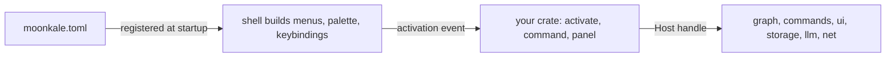

Moonkale is extension-driven: the built-in editors are extensions. This guide takes you from an empty folder to a panel, a command, a language and a data source. Reference material: [[Manifest Reference]], [[Contribution Points]], [[Host API Reference]], [[Publishing and Platforms]].

> [!note] Status
> The extension API (`packages/ext-api`) is designed but not implemented. This guide documents the *intended* shape so that the implementation is held to it. Where details are still open, the text says so.

## 1. What an extension is

An extension = a **manifest** (`moonkale.toml`, declarative) + **code** (Rust, optionally compiled to a WASM component). The manifest is read first and drives the UI before your code runs; code is activated lazily.



Two kinds:

| kind | runs as | can render | platforms | when to choose |
|---|---|---|---|---|
| `static` | Rust crate linked into the binary | full Dioxus `Element` | all | first-party editors, anything needing wgpu or raw Dioxus |
| `wasm` | WASM component loaded at runtime | declarative `ui::Tree` | desktop, server, web (Worker) | everything distributable |

Both implement the same `Extension` trait against the same `Host`.

## 2. Create the crate

```text
my-extension/
├─ Cargo.toml
├─ moonkale.toml
└─ src/lib.rs
```

`Cargo.toml`:
```toml
[package]
name = "my-extension"
version = "0.1.0"
edition = "2021"

[lib]
crate-type = ["cdylib", "rlib"]   # cdylib for wasm, rlib for static

[dependencies]
moonkale-ext-api = "0.1"
serde = { version = "1", features = ["derive"] }
```

`moonkale.toml` (see [[Manifest Reference]]):
```toml
[extension]
id      = "dev.example.hello"
name    = "Hello"
version = "0.1.0"
api     = "^0.1"
kind    = "wasm"

[activation]
on = ["command:hello.*", "view:hello.panel"]

[[contributes.command]]
id = "hello.greet"
title = "Hello: Greet"
args = { name = "string" }

[[contributes.panel]]
id = "hello.panel"
title = "Hello"
home = "side"
```

## 3. Implement `Extension`

```rust
use moonkale_ext_api::prelude::*;

#[derive(Default)]
struct Hello { greetings: u32 }

impl Extension for Hello {
    fn activate(&mut self, host: Host) -> Result<(), ExtError> {
        host.set_status("Hello activated");
        Ok(())
    }

    fn command(&mut self, id: &str, args: Value) -> Result<Value, ExtError> {
        match id {
            "hello.greet" => {
                self.greetings += 1;
                let name = args["name"].as_str().unwrap_or("world");
                Ok(json!({ "message": format!("Hello, {name}!") }))
            }
            _ => Err(ExtError::UnknownCommand),
        }
    }

    fn panel(&mut self, _id: &str, ctx: PanelCtx) -> PanelOutput {
        ui::column([
            ui::text(format!("Greeted {} times", self.greetings)),
            ui::button("Greet", Action::command("hello.greet", json!({"name": "you"}))),
        ]).into()
    }
}

moonkale_ext_api::export!(Hello);   // static: inventory registration; wasm: component exports
```

That is a complete extension. Build:
- static: add the crate to the `desktop`/`web` binary's dependencies (first-party only);
- wasm: `cargo component build --release` → `target/wasm32-wasip2/release/my_extension.wasm`.

Install (desktop): copy the folder to `~/.config/moonkale/extensions/dev.example.hello/`. See [[Publishing and Platforms]].

## 4. Talk to the graph

The `Host` gives you the same surface every editor uses ([[Graph-Native Model]]):

```rust
// find markdown pages linking to the current node
let view = host.query(Query::neighbours(ctx.node, Direction::In).kind(EdgeKind::Links)).await?;
for node in view.nodes() { host.notify(format!("{} links here", node.label)); }

// read content
let text = host.fetch(ctx.node).await?.as_text()?;

// write (requires permissions.sources = ["write"])
host.apply(Transaction::new().update_props(ctx.node, [("reviewed", Value::Bool(true))])).await?;

// react to changes
let mut events = host.subscribe(Filter::kind(NodeKind::Page));
while let Some(ev) = events.next().await { /* … */ }
```

Queries fan out across all open sources you're permitted to read. You never see connection strings, file handles or sockets.

## 5. Contribute things

Each `[[contributes.*]]` table in the manifest is a [[Contribution Points|contribution point]]:

| you want to add… | contribute | code needed? |
|---|---|---|
| a dockable panel | `panel` | `panel()` |
| a command (palette, menus, keybindings, LLM tool) | `command` | `command()` |
| an editor for a node kind | `editor` | `panel()` keyed by node |
| a language (grammar, highlight, LSP) | `language` | no — data only |
| a database / data source | `source` | `SourceFactory` impl (native) |
| node/edge visuals in the graph view | `renderer` | no (declarative) / yes (custom) |
| a keybinding, a theme | `keybinding`, `theme` | no |
| an LLM tool | `command` with `llm_tool = true` | `command()` |

Worked examples: [[Example - Hello Panel]], [[Example - Data Source]], [[Example - Language]].

## 6. Permissions

Declare what you need; users grant on first use; every `Host` call is checked.

```toml
[permissions]
sources = ["read", "write"]
network = ["https://api.example.com/*"]
process = false
llm     = true
```

A denied call returns `ExtError::Denied(Capability)` — handle it, don't unwrap. See [[Host API Reference]].

## 7. State and panels

Panel content is remounted on structural moves (docking into another group). Keep state in your extension struct or in `host.kv_*` storage, not in the panel tree. Static extensions can use Dioxus signals; the rule is the same: state lives outside the panel.

## 8. Platforms

Declare `platforms = ["desktop", "web"]` if you depend on a capability that isn't everywhere (process spawning, native drivers). Check the [[Platform Matrix]]. A `source` contribution using a native driver is desktop/server-only automatically; the shell offers it to web users through the server.

## 9. Testing

- `moonkale-ext-api` ships a `TestHost` (in-memory sources, recorded calls) so `command()` and `panel()` can be unit-tested with plain `cargo test`.
- `moonkale dev --extension ./my-extension` (planned) runs the desktop app with your extension hot-reloaded on rebuild.

## 10. Versioning

`api = "^0.1"` is checked against `moonkale-ext-api`'s version. Breaking API changes bump the major and get a migration note in [[Problem Log]]. Contribution *points* are part of the API; contribution *instances* are not.

## Checklist before publishing
- [ ] manifest validates (`moonkale ext check`)
- [ ] permissions are minimal
- [ ] commands have `title`, `args` schema and, if agent-safe, `llm_tool = true` with a `risk`
- [ ] panels keep state outside the tree
- [ ] `platforms` is honest
- [ ] README with screenshots
