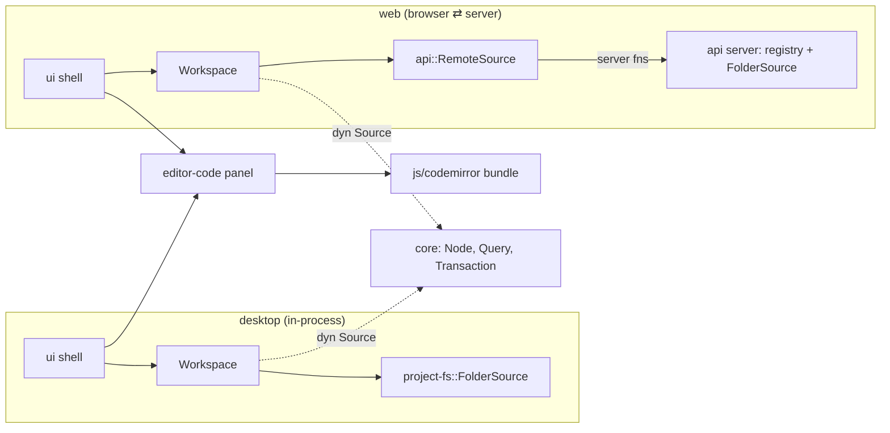

**Goal** (from [[Roadmap]]): *open a folder, edit and save files in a dockable workbench, on desktop and web (server-side folder).* **Proves**: the graph model, the JS interop boundary, the extension API.

This note is the plan. The record of what actually happened is [[Milestone 1 - Implementation Log]].

## Starting point

- `ui::EditorWorkbench` — a dummy workbench with hard-coded placeholder panels (Prompt 1).
- 22 crates under `packages/` containing **only doc comments** and `pub mod` lines.
- No dependencies beyond `dioxus` and `dioxus-workbench`.
- `api::echo` is the only server function.

## Scope: what "done" means

A user can, on **desktop** (`dx serve --platform desktop`) and on **web** (`dx serve` in `packages/web`, folder lives on the server):

1. type a folder path and open it;
2. see its file tree in an Explorer panel (`.gitignore`-aware);
3. click a file → it opens as a closable editor tab (CodeMirror);
4. edit, see a dirty marker, press **Ctrl+S** or click *Save* → the file on disk changes;
5. drag the editor tab into another group and keep editing (state survives the remount);
6. re-open the file → it shows the saved content with a fresh version.

**Explicitly out of scope** (later milestones): file watching, LSP, highlighting, search, multiple sources at once, mobile polish, persistence of layout, native folder picker, auth on the server.

## The seams that must exist

The same `ui` and `editor-code` code runs on both platforms; only the `Source` behind the `Workspace` differs. That is the milestone's whole point.

## Steps, in order

Each step ends with `cargo check --workspace` green and, where stated, tests.

### Step 1 — `moonkale-core`: the minimum model
Implement (replacing the comment stubs):
- `id`: `SourceId(String)`, `NodeId(Uuid)` with `NodeId::derive(&SourceId, &str)` — **UUID v5**, deterministic, no lookup table.
- `graph::node`: `Node { id, source, kind: NodeKind, label, path: Option<String>, content: Option<ContentRef>, version: Version }`. `NodeKind::{Directory, File, Custom(String)}` — only the kinds this milestone uses; the open enum shape is kept.
- `graph::edge`: `Edge`, `EdgeKind::Contains` (others later).
- `Version(u64)`; `ContentRef::{Text{len}, Blob{len}}`.
- `source::query`: `Query::{Node(NodeId), Children(NodeId)}` → `QueryResult { nodes, edges }`.
- `source::transaction`: `Transaction { ops: Vec<Op> }`, `Op::WriteText { node, expected: Version, patch: TextPatch }`, `TextPatch::Replace(Vec<Splice>)` where `Splice { start, end, text }` in **char** offsets. M1 sends one whole-document splice; the type is right, the producer is lazy.
- `source::Source` trait: `descriptor()`, `query`, `fetch_text`, `apply` — async, object-safe via `async-trait` (`?Send` on wasm32).
- `error::SourceError::{NotFound, Conflict{expected,actual}, Unsupported, Io(String)}`.
- Tests: id determinism, splice application, conflict detection.

Dependencies added: `serde`, `uuid` (v5, serde, js), `async-trait`, `thiserror`.

### Step 2 — `moonkale-project-fs`: the native folder source
- `FolderSource::open(PathBuf)`; ids derived from `(SourceId, relative path)`.
- `Children(dir)` → `ignore::WalkBuilder` one level deep (respects `.gitignore`, skips `.git`), sorted dirs-first.
- `fetch_text` → `tokio::fs::read_to_string`; **Version = hash of (mtime, len)** — cheap, changes on any external write; documented limitation: two writes within one mtime tick with equal length collide (acceptable for M1, content hash later).
- `apply(WriteText)`: read current version → compare → apply splices → write to `<file>.moonkale-tmp` → `rename` (atomic) → return new version.
- Platform gating: crate is `#[cfg(not(target_arch = "wasm32"))]` inside; the `web` crate never depends on it.
- Integration tests in `tests/` with `tempfile`: tree listing, ignore, round-trip write, conflict.

### Step 3 — `moonkale-sources`: registry
- `SourceRegistry { sources: HashMap<SourceId, Arc<dyn Source>> }` with `insert/get/descriptors`. Small and synchronous (`RwLock`).
- **Decision**: `RemoteSource` moves to `api` (not `sources`) — it needs the server functions, and `api` needs the registry; putting the client stub next to its server functions avoids a dependency cycle. Vault [[Data Sources]] updated.

### Step 4 — `api`: server functions + `RemoteSource`
- Server-side state: a `static REGISTRY: OnceLock<SourceRegistry>` (feature `server`).
- Server functions (`#[post]`): `open_folder(path) -> SourceDescriptor`, `query(source, query) -> QueryResult`, `fetch_text(source, node) -> (String, Version)`, `apply(source, tx) -> Applied`.
- `RemoteSource { id }` implements `Source` by calling them — compiled on every client.
- Security note in the doc: `open_folder` takes a server path. Dev-only; a `MOONKALE_ROOT` env var restricts it to a subtree. No auth yet ([[Platform Matrix]] security list still applies).
- `api` gains `server`-gated deps on `project-fs` and `sources`.

### Step 5 — `moonkale-ext-api`: the smallest real contract
- `Manifest { id, name }`.
- `PanelContribution { id, title, home, closable }`; `EditorContribution { kinds }`.
- `trait Extension { fn manifest(&self) -> Manifest; fn panels(&self, ws: &Workspace) -> Vec<PanelContribution>; fn render(&self, panel: &str, ws: Workspace) -> Element; }`.
- `Workspace` — the host handle for this milestone: a `Copy` bundle of signals (`sources`, `open_nodes`, `active_node`, `status`) plus `open_folder(path)`, `open_node(id)`, `close_node(id)`. It **is** the `Host` from the design, reduced to what two extensions need.
- Depends on `dioxus` (static extensions return `Element`) and `core`. Decision recorded: the wasm `ui::Tree` path is not started.

### Step 6 — JS interop: `packages/js/codemirror`
- `npm install @codemirror/{state,view,commands}`; `src/index.ts` exposes `window.moonkale.codemirror = { mount(el, text, onChange), setText(id, text), destroy(id) }`.
- `esbuild` → **`packages/editors/code/assets/codemirror.js`** (the artifact lives inside the crate so `asset!()` can reach it; the source stays in `packages/js`). Committed.
- Transport = Dioxus `document::eval` with `dioxus.send()` / `dioxus.recv()` (verified in 0.7.10 docs) — not `CustomEvent` as the vault first sketched. [[JS Interop Boundary]] updated.
- `PROTOCOL.md` filled in for real.

### Step 7 — `moonkale-editor-code`
- `Document { node, text, version, dirty }` in a signal — the Rust-owned truth ([[ADR-0008 Rust owns the document, JS is a view]]).
- `CodeEditorBackend` trait + `CodeMirrorBackend`: mount via eval (waits for the bundle), forwards `change` events into the signal, `set_text` after save/reload.
- `CodeEditorPanel(node)` component: toolbar (path, dirty dot, Save), `onkeydown` Ctrl+S, mounts the backend in a `div` with a stable id.
- `CodeEditorExtension` implementing `Extension`: one closable panel per open node.

### Step 8 — `ui`: the real shell
- Replace `EditorWorkbench` with `Shell { extensions }`: builds `dioxus_workbench::Panel`s from every extension's `panels()`, `on_panel_close` → `ws.close_node`, `active_panel` follows `ws.active_node`.
- `ExplorerExtension` (in `ui` for now): open-folder input, lazy tree (expand on click → `Query::Children`), file click → `ws.open_node`.
- Status bar: source name, active file, dirty state, last message.
- Platform wiring: `desktop`/`mobile` `Home` → `Shell` with a local `FolderSource` factory; `web` `Home` → `Shell` with the `RemoteSource` factory. The choice is one `cfg` in `Workspace::open_folder`.

### Step 9 — Verify
- `cargo test --workspace --exclude web`, `cargo check -p web --target wasm32-unknown-unknown`.
- `dx serve` web: open the repo folder, edit `README.md`, save, `git diff` shows it. Screenshot.
- Desktop: `cargo check -p desktop --features desktop` (no display on the dev box; a manual run is on the human).

### Step 10 — Document
- [[Milestone 1 - Implementation Log]]: what was done per step, what deviated from this plan and why, problems hit → [[Problem Log]].
- A markdown note **next to the code** in each touched crate (`packages/<crate>/<crate>.md`), describing the implementation and its critical decisions, for readers who arrive from the code rather than the vault.
- Update [[Roadmap]] status, [[Project Structure]] where the layout changed.

## Risks specific to this milestone

| risk | mitigation |
|---|---|
| `async-trait` + `Send` differs between wasm and native | `cfg_attr` the `?Send` variant on wasm32; test both `cargo check` targets every step |
| CodeMirror bundle not loaded when the panel mounts | the mount eval polls for `window.moonkale.codemirror` before mounting |
| Editor panel remount on dock loses text | text lives in the `Document` signal owned by the workspace, not the panel; remount re-mounts CodeMirror with the same text |
| `document::eval` on WebKitGTK | same API on all webviews; verified only on web headlessly here — desktop run is manual |
| server fn payload size for big files | M1 has no cap; note in the log; cap + streaming later |
