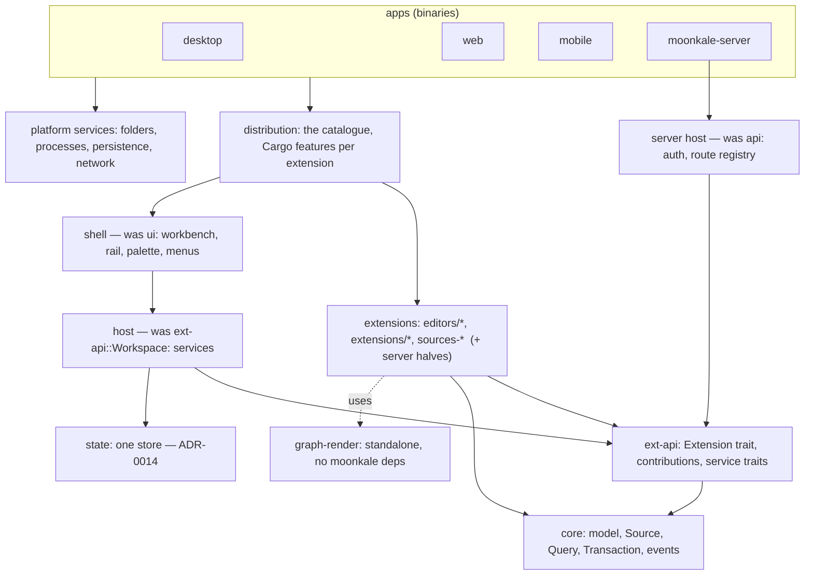

Log: [[Milestone 18 - Implementation Log]]. Requested 2026-10-01 on the `refactor` branch: look at what is actually built compared with what the vault says, refactor the vault, and plan a refactored Moonkale library. The vault half is done ([[Status]] is the new single page for "where are we"). This note is the library half: **a plan, not yet started**. Inputs: the critique in [[Extension Catalogue]] (2026-09-19, still accurate and now larger), the [[Audit 2026-09-23]], [[Internal State]] and the announced store comparison ([[ADR-0014 One store for internal state]]), and the long-term goals — [[Julia and Lenticulum]] and the content-addressed code graph (Sophia), for which Moonkale should be the *editor and viewer library*, not only an app.

## Where the code stands (measured 2026-10-01, `refactor` = `master` + Milestone 17)
- 38 workspace crates, 43 600 lines of Rust, 129 Rust tests, 47 browser suites. No CI job runs any of them.
- **`ext-api::Workspace`** is 2 603 lines with **39 public signals** (sources, documents, history, settings ×4, presence, drag state, remote, server link, terminals, vcs status, editor choice, cursor, epochs …) and 94 public methods. Every extension holds it; every change touches all of them. (It was 1 752 lines when the catalogue critique called it too big.)
- **`WorkspaceConfig`** is 19 optional closures that each platform crate fills in (`desktop/src/main.rs:687` is one 700-character line).
- **The "contract" crate is not small**: `moonkale-ext-api` depends on `dioxus`, `moonkale-llm` (settings and session types), `moonkale-ext-host` (ABI types), `moonkale-lsp` and `moonkale-terminal`.
- **Layering breaks**: `moonkale-llm` depends on `moonkale-sources-sql` (for the SQL statement classifier); `ui` depends on every editor, on Lux, git, `api`, and on the three driver crates (the Explorer calls `is_sqlite_path`, `is_turso_path`, `is_rocksdb_path` …); `api` depends on the git extension.
- **One decision, four copies**: "which file opens as which database" is written out in `desktop/src/main.rs` (`open_database`), `api/src/lib.rs` (`open_any`), `mobile/src/main.rs` and the Explorer's `is_db_path`.
- **Editors know each other**: the catalogue in `ui::default_extensions()` wires the code editors with `.skipping(|n| is_markdown(n) || is_flow(n))`.
- **Design stubs compiled as code**: 21 files of doc comments only (`sources/{credentials,lift,connect,remote}.rs`, `sources-graph/{dialect,structured,schema,falkor,typedb}.rs`, `sources-kv/{patterns,values,redis}.rs`, `sources-sql/{postgres,schema,structured}.rs`, `editors/code/{decorations,document,backend/native}.rs`, `core/command/*`, `core/graph/view.rs`), a whole stub crate (`editors/graph-desktop`), and empty features (`typedb`, `falkor`, `redis`, `postgres`).
- Housekeeping: the repo commits its own `.moonkale/` state; `[profile.wasm-release]` collides with dx's profile name (P-135); binaries report `0.1.0` while releases are `YYMMDD-proto`; four crate READMEs are the Dioxus template's; `api/src/lib.rs` still says "there is no authentication".

## What "a library" means here
1. **A small core anyone can depend on**: the model (`moonkale-core`), the extension contract (`moonkale-ext-api`) and the graph renderer (`moonkale-graph-render`), each buildable and testable without Dioxus apps, drivers, LLM providers or a server.
2. **Everything else is a contribution**: editors, sources, server routes, agent providers — added by listing a crate in a distribution, never by editing the shell.
3. **The app is an assembly**: desktop, web, server and mobile pick a distribution (a set of extensions behind Cargo features) and provide platform services.
4. **Reusable outside Moonkale**: a Lenticulum or Sophia viewer can embed the graph renderer and the model, and later the shell, with its own extensions.

## Target shape

Rules the shape enforces (each checked by a test in CI, phase 0):
- `core` depends on no workspace crate; `ext-api` only on `core` (and the pure `lsp`/`terminal` protocol crates); no crate except `distribution` and the apps depends on an extension or a driver.
- `cargo tree -p moonkale-shell` contains no `duckdb`, `lbug`, `rocksdb`, `turso`, `helix-db`, `wasmtime`, `reqwest`.
- A new editor, source or server route is added by a crate plus one line in `distribution`.

## Phases
Each phase ends with the workspace building on all targets, the Rust tests and the E2E suites passing, and the app usable — no long-lived broken branch. Sizes are relative (S/M/L), not dates.

### Phase 0 — Safety net (S)
1. **CI workflow** `ci.yml` on every push and PR: `cargo fmt --check`, `cargo clippy --workspace -- -D warnings` (allow-list existing warnings first), `cargo test --workspace`, `cargo check -p web --target wasm32-unknown-unknown`, and a Linux E2E smoke batch (`milestone1`, `files`, `rich`, `graph`, `stores`) on Chromium. Cache `target/` per lockfile. ([[Problem Ranking]] R-39)
2. **Dependency rules as tests**: a small `xtask deps` (or a `cargo metadata` script) that fails when a rule above is broken; run in CI, initially with today's violations listed as known.
3. **Baseline numbers**, written into the log: clean build time (desktop, server, web, APK), binary sizes, test counts, cold-open time of this repository.
4. Stop committing app state: `git rm --cached .moonkale/{history.jsonl,settings.json}`, ignore `.moonkale/` except the files a folder shares on purpose.

### Phase 1 — Prune (S)
1. Delete the 21 stub files and `editors/graph-desktop`; their design text already lives in the vault ([[Data Sources]], [[ADR-0011 Desktop graph surface strategy]], [[Code Editor]]) — move anything that is only in a stub into the note first.
2. Remove empty features (`typedb`, `falkor`, `redis`, `postgres`) and the `moonkale-sources` items that are only comments; `sources` keeps its registry.
3. Rename `[profile.wasm-release]` (→ `graph-wasm`, P-135); derive the binaries' version from the release tag (`MOONKALE_VERSION` at build time; `remote::session::VERSION` follows it so a remote host gets the new server).
4. Replace the template READMEs (`api`, `desktop`, `web`, `ui`) by one line pointing at the crate note; fix stale crate doc comments (`api` "no authentication", `ext-api` "Milestone 1 scope", `core` "Milestone 1 status").
5. Fix issue #16 (Julia/Python symbols) on the way: it is a one-line mistake that phase 2 makes impossible to repeat.

### Phase 2 — Layering and extension points that exist only as hard-coded calls (M)
1. **`moonkale-ext-abi`**: the wasm ABI types (`WasmManifest`, `RunRequest`, `HostCall` …) move out of `ext-host` into a dependency-free crate; `ext-api`, `ext-host` and guest extensions (wordcount) use it. `ext-api` drops `ext-host`.
2. **Statement classification belongs to the source**: `Source::classify(&self, dialect, text) -> Risk` (default: `Unknown` → ask). SQL sources implement it with today's classifier, graph sources with a Cypher/HelixQL one (#9's missing Cypher gate). `llm::policy` asks the source; `moonkale-llm` drops `moonkale-sources-sql`.
3. **Source openers**: `SourceOpener { id, matches(path, kind) -> bool, open(path) -> Future<Arc<dyn Source>> }` contributed by driver crates and collected in `moonkale-sources`. Desktop, server and mobile call one `open_any`; the Explorer asks the registry instead of calling `is_*_path`. This is the "file-opener contribution" of the catalogue critique, and the place where a `moonkale-sources-extra` crate later plugs in.
4. **Editor claims**: `Extension::claims(&Node) -> Option<Priority>` replaces `.skipping(…)` closures and the hand-written `editor_for` table; *Open with…* lists every claimant.
5. **Extractor registry in the index**: each extractor says which languages it reads; `walk::wants_text` asks the registry (issue #16 cannot recur).

### Phase 3 — The `Workspace` becomes services (L)
The `Workspace` stays the handle extensions receive, but as a facade over services, each a module with its own signals, methods and tests:

| service | takes from today's `Workspace` | notes |
|---|---|---|
| `sources` | `sources`, `watched`, `fs_epoch`, open/close/attach/refresh/follow | uses the opener registry |
| `documents` | `documents`, `active`, `views`, `editor_choice`, `cursor`, `cursor_line`, save/reload/create/rename/delete/replace | the largest piece |
| `history` | `history`, `pending_actor`, `pending_cause`, record/compact/restore | persistence moves in phase 5 |
| `settings` | `settings_user/_workspace/_folder`, `settings`, load/update | settings **namespaced per extension**: the shell keeps keybindings, theme, editor choice, *You*; the agent extension owns `llm`/`agents`/`policy`, the terminal extension its shell, … — `ext-api` stops importing `moonkale-llm` |
| `layout` | `closed_panels`, `hidden_tiles`, `commands`, `status`, `reveal`, `graph_request`, `unique` | shell state |
| `session` | `window`, `peers`, `foreign_drag`, `own_drag`, `presence` | the bus and presence |
| `remote` | `remote`, `server_link`, saved connections | desktop only |
| `extensions` | `wasm_extensions`, `flow_libraries` | contributions registry |
| *moves to its extension* | `vcs_status` (git), agent sessions (agent), `adopt_terminals`/`terminal_cwd` (terminal) | an extension's state is the extension's |

`WorkspaceConfig`'s 19 closures become **platform service traits** grouped by what they need from the OS — `FolderAccess` (open, pick), `Processes` (terminal, program, LSP; `None` on the web client and the phone), `Persistence` (settings and secret stores — the state store in phase 5), `Network` (server client, presence, remote hosts), `Runtimes` (wasm, Typst, LLM). Each is `Option<Rc<dyn …>>`, and its presence is also a context key the shell can show or hide UI by.

**The state interface (decided 2026-10-01: interfaces first, stable for redb, then the comparison).** Inside `Persistence`, a `moonkale-state` crate defines the store *interface* before any backend is chosen:
- a small trait over **typed tables of keys → values** with ordered range scans and multi-table write transactions — `StateStore { read(tx) / write(tx) }`, `Table<K, V>` with `get`, `put`, `delete`, `range(prefix)` — which is exactly redb's model, so **redb is the reference implementation** and the shape is checked against it first;
- the record types on top of it, versioned with serde: settings per scope and extension namespace, layout, open documents, saved agents and connections, agent sessions, entity-log events (keyed by folder id + event id, so a range scan replays a folder and two devices' logs merge by key), projects, and index caches (keyed by content hash + model version);
- a conformance test suite every backend must pass (crash-safety, ordering, concurrent readers, migration from the old files);
- the existing file formats as a second implementation (`FileStore`), so phase 3 lands without changing what is on disk.

The interface is frozen when redb and `FileStore` both pass the suite; only then does the comparison run (phase 5).

Done when `workspace.rs` is a facade under ~500 lines, each service has unit tests without a Dioxus runtime where possible, and no extension reads a signal of another extension.

### Phase 4 — Catalogue out of the shell; server contributions (M)
1. **`moonkale-distribution`**: `default_extensions()` moves out of `ui` into a crate with one Cargo feature per extension (`git`, `agent`, `flow`, `lux`, `table`, `stores`, …); `--no-default-features` builds Explorer, Search, Settings, Code, Markdown, Graph. `ui` (renamed `moonkale-shell`) depends on `ext-api` and the host only.
2. **History panel** → `packages/extensions/history`; git types (`ext-api/git.rs`) → the git crate.
3. **Server contributions**: an extension crate with a `server` feature brings its server functions and websocket routes; `api` becomes the server *host*: auth, the jail, the audit log and a route registry. Git, LSP, terminal, Typst, wasm, presence, MCP and the LLM relay move into their crates' server halves. (Spike first: Dioxus 0.7 server functions register at link time through `inventory`, so functions defined in an extension crate should register when that crate is linked into the server — verify with one before moving all.)
4. **"The server decides"** ([[Security]]): provider endpoints, extension grants and agent commands are resolved from the server's own settings; workspace-scope settings may not name commands or grant permissions. Closes the structural part of #1, #4, #8.

### Phase 5 — The store comparison, then one store (L)
Runs after the state interface of phase 3 is frozen. Every candidate — **redb** (reference), Turso, RocksDB, embedded HelixDB, SQLite as the baseline — is implemented behind the same `StateStore` trait and run through the conformance suite and the measurements listed in [[Internal State]] (log writes and replay at 10⁵–10⁶ events, settings write latency, cold open, clean-build cost and binary size on Linux/Android/Windows/macOS, kill-mid-write recovery, two windows writing). The results go into [[ADR-0014 One store for internal state]], which becomes *accepted* with the winner. Then: the winner becomes the default `Persistence` backend, a one-time migration reads the old files, the folder keeps only what it shares on purpose, and the entity log's merge and compaction issues (#17, P-086) are fixed by the keyed layout. Projects ([[Projects and Sources]], R-40) and a persisted index build on it; sync through the hub comes after this milestone.

### Phase 6 — Library surface (M)
1. **`moonkale-graph-render` standalone**: no `moonkale-*` dependencies already — give it a documented Rust API (graph in, events out) beside the wasm glue, an example outside the app, and its own README, so a Lenticulum viewer can use it ([[Julia and Lenticulum]]).
2. **`moonkale-core` as the model**: the missing half decided — node/edge properties, `GraphView` or its removal from the design, content-addressed ids as an option (the Sophia use case), `subscribe` vs `changes_since`.
3. **`moonkale-ext-api` versioned**: a `CHANGELOG`, the public surface documented with rustdoc, `#[non_exhaustive]` on contribution structs; the extension guide rewritten against it ([[Writing an Extension]]). Outside crates depend on `core`, `ext-api` and `graph-render` **by git tag**, not crates.io (decided 2026-10-01); a tag `lib-vN` marks each compatible state.
4. **Lux → `MathStruct/moonkale-julia`** in this milestone (decided 2026-10-01; it is Daniel's own tool, off by default for everyone else): the crate moves with its history, depends on `ext-api` by git tag, and `distribution` gets an off-by-default `julia` feature that pulls it by git.
5. **Renames and directory grouping — free hand (decided 2026-10-01), on one condition: every move is written down.** Planned: `ui` → `moonkale-shell`, `api` → `moonkale-server-host`, and directories `apps/{desktop,web,mobile}`, `services/`, `sources/`. Each rename lands as its own commit containing only the move (so `git log --follow` and blame keep working), and the implementation log gets a **rename table** — old path → new path → why — plus the commands that changed (`dx serve` directories, `fixture.sh`, packaging scripts, CI). [[Project Structure]] is regenerated in the same commit.

### Phase 7 — Documentation (S, and in every phase)
[[Project Structure]] and [[Overview]] redrawn from `cargo metadata`; crate notes stay **next to the code** (decided 2026-10-01) and are linked from the vault: every crate has a row with a link to its `<crate>.md` in [[Project Structure#Crate notes]], and every crate note starts with a link back to its design note; updated in the same change as the crate; an agent guide (`CLAUDE.md`/`AGENTS.md`) that points at the vault, the conventions (specs, P-numbers, logs, the catalogue rule), `CARGO_TARGET_DIR=target/agent` and the E2E setup. The implementation log of this milestone records each phase like the others.

## Order and why
0 → 1 → 2 → 3 (with the state interface, frozen against redb) → 5 (comparison, then the store) → 4 → 6. Phase 0 first because nothing else is safe without CI. Phase 2 before 3 because it removes the dependencies that would otherwise be copied into the new services. The state interface is part of 3 because settings and history become services there anyway; the comparison waits until that interface is frozen so every candidate is measured against the same thing. Phase 4 needs 3's settings namespaces. New features wait until 4 is done, except fixes for the audit's local findings (#2, #5, #10, #11, #14, #15), which can go in at any time.

## Not in this milestone
Database writes (R-41), projects UI, the coarse graph tier, components/WIT for wasm extensions, a Rust rich-text editor, CRDT editing.

## Decisions (Daniel, 2026-10-01)
1. **Interfaces first, stable for redb, then the comparison** — the state interface is designed in phase 3 with redb as the reference implementation; the comparison (phase 5) measures every candidate behind it.
2. **Depend by git** for now — no crates.io publishing; git tags mark compatible states.
3. **Renames and regrouping: free hand**, with enough written down (a rename table in the log, one move per commit) to follow later.
4. **Lux moves to `MathStruct/moonkale-julia`** in this milestone — it is what Daniel needs; for other users it is an off-by-default feature.
5. **Crate notes stay next to the code**, linked both ways with the vault ([[Project Structure#Crate notes]]).
