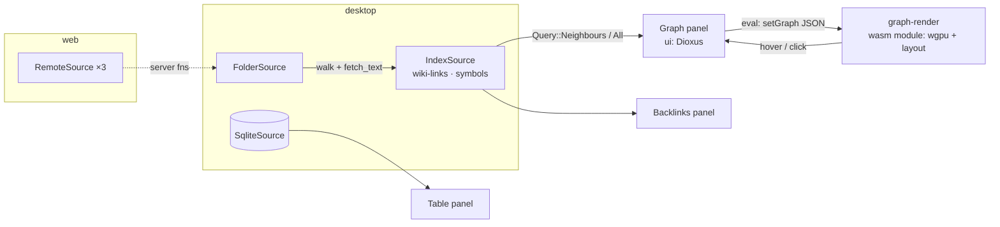

**Goal** (from [[Roadmap]] Phase 2): *see your folder + wiki-links + symbols as a graph; open a SQLite file and browse tables; edit markdown with backlinks.* **Proves**: "graph-native" is real; wgpu works inside webviews.

Record of what actually happened: [[Milestone 2 - Implementation Log]].

## Starting point (after Milestone 1)
- Folder source, code editor, workbench shell, multi-window session — working on web and desktop.
- `core` has `Query::{Node, Children}` only; no derived data; no `Value`/rows; `index`, `editors/graph`, `sources-sql`, `editors/table` are comment-only.
- Toolchain: `wasm-bindgen` 0.2.128 (from dx) for a standalone wasm module; tree-sitter is native-only.

## Scope: what "done" means
On **desktop** and **web**:
1. Opening a folder also builds an **index**: `[[wiki-links]]`/markdown links between `.md` files, and Rust symbols (`fn`, `struct`, `enum`, `trait`, `mod`, `impl`) via tree-sitter. Status bar reports counts.
2. A **Graph** panel renders files, pages, links and symbols with **wgpu** in a `<canvas>` (WebGPU, WebGL2 fallback), force-directed layout, pan/zoom, hover popup with label/kind/path, double-click opens the file. Target: fluid at a few thousand nodes.
3. Editing a markdown file shows its **backlinks** in a panel; the graph can be switched to a **local graph** around the active document.
4. Saving a file **re-indexes** it; the graph updates.
5. Opening a `.sqlite`/`.db` path registers a **SQLite source**: tables appear in the Explorer; a **Table** panel shows rows; a SQL box runs read-only queries.

**Out of scope**: DuckDB (C++ build), LSP symbols, references/call graph, GPU compute layout, 3D, labels on GPU (labels are a 2D-canvas overlay), cell editing in the table, persistence of the index (rebuilt on open).

## Architecture decisions for this milestone

- **The renderer is a separate wasm module** (`packages/editors/graph-render`, `cdylib` + `wasm-bindgen`), loaded as an asset exactly like `codemirror.js`, driven over the eval channel. This is [[ADR-0011 Desktop graph surface strategy]] plan A: one code path in the browser *and* inside the desktop webview, where the app's own Rust runs natively and cannot draw into the DOM. `wgpu` picks WebGPU when present, WebGL2 otherwise.
- **The index is a `Source`** (`index:<folder id>`) so the graph panel, backlinks and agents query it like anything else. It is created by the platform's `open_folder` alongside the folder (desktop in-process; on the server for web) — `OpenFolder` now returns *several* sources.
- **Derived nodes**: `Symbol` (native key `path#name`), `Page` for unresolved link targets (Obsidian-style phantom nodes). Edges: `Links` (page → file), `Defines` (file → symbol). Cross-source: the index owns the edges, the endpoints belong to the folder.
- **Re-index on save**: `Source::refresh(node)` (new trait method, default no-op) — the workspace calls it on every source after a successful save; the index re-extracts that file.
- **Rows**: `core` gains `Value` and `Table { columns, rows }`; `Query::Text { dialect, text }` and `QueryResult.table`. SQLite is the first `sources-sql` backend (`rusqlite`, bundled); DuckDB waits.

## Steps

| # | step | crates | verify |
|---|---|---|---|
| 1 | `core`: `Query::{Neighbours, All, Text}`, `Value`/`Table`, `Source::refresh`, `EdgeKind::Defines/Links` already exist | core | unit tests |
| 2 | `index`: in-memory graph; folder walk (bounded: ≤5000 files, ≤512 KB each, text only); extractors `wikilinks`, `symbols_rust` (tree-sitter); `IndexSource`; `refresh` | index | integration tests on a tempdir vault |
| 3 | platforms: `open_folder` returns `[folder, index]`; server registers both; `refresh` server fn; status counts | desktop, api, web | `cargo check` all targets |
| 4 | `graph-render`: wasm module — wgpu surface on a canvas, instanced nodes (SDF circles) + edges, camera, CPU force layout, hover/click hit-test, 2D-canvas label overlay, `build.sh` → `editors/graph/assets/` | graph-render | builds; smoke page |
| 5 | `editors/graph`: Graph panel (extension) — loads module, sends graph JSON, popup, double-click opens file, toolbar (fit, relayout, whole/local) | editors/graph, ui | E2E: canvas present, node count reported, hover popup |
| 6 | `editors/markdown` (source mode): Backlinks panel for the active document | editors/markdown, ui | E2E: link A→B, open B, backlink lists A |
| 7 | `sources-sql` SQLite + `editors/table`: open `.sqlite` path → source; Explorer lists tables; Table panel with rows + SQL box | sources-sql, editors/table, ui | integration test on a tempdir DB; E2E on web |
| 8 | verify on web with Playwright; desktop `cargo check`; log + vault |  | |

## Risks
| risk | mitigation |
|---|---|
| wgpu in WebKitGTK without WebGPU | WebGL2 backend is compiled in; the module reports which backend it got (shown in the popup/toolbar) |
| Dynamic `import()` of the ESM module from `dioxus://` asset URLs on desktop | the loader is one line of JS in the eval; if the custom scheme refuses ESM, fall back to `--target no-modules` (a global) — documented as a fallback |
| tree-sitter C build in the workspace (also on wasm checks) | `index` is native-only (`cfg`), like `project-fs` |
| O(n²) CPU layout | fine to ~3k nodes; node cap + "graph truncated" message; GPU layout is P-22 |
| SQLite scope creep | read-only in M2; editing needs PK handling (P-08 continues) |
