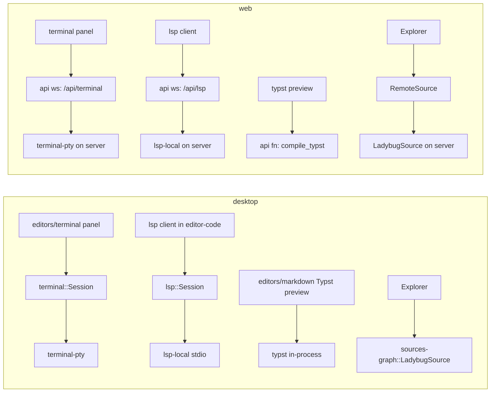

**Goal** (from [[Roadmap]] Phase 3): *connect Postgres-class and graph DBs (via server on web), get LSP features, use a terminal, preview Typst, WYSIWYG markdown.* Record: [[Milestone 3 - Implementation Log]].

## Starting point (after Milestone 2)
- Folder + index + SQLite sources, graph view (wgpu, WebGL2 on Linux desktop), code editor (CodeMirror, no language support yet), links panel, table editor, multi-window sessions.
- `terminal`, `terminal-pty`, `lsp`, `lsp-local`, `sources-graph` are comment-only; `editors/terminal` and the Typst half of `editors/markdown` too.
- Transport available for web parity: **Dioxus fullstack typed websockets** (`#[get] fn … -> Websocket<In, Out>`), not yet used.
- Machine: `julia`, `lean`/`lake` present; `rust-analyzer`, `cmake` absent (asked for).

## Scope: what "done" means
On desktop and web:
1. **Terminal** — a Terminal panel (xterm.js view) running the user's shell: local PTY on desktop, a PTY on the server for web, both through one `Session` model; multiple terminals as tabs; "New terminal here" on a folder; a compiler error path in the output opens the file.
2. **Typst** — a `.typ` file opens with a live SVG preview beside the source (compile in-process on desktop, on the server for web; embedded fonts).
3. **LSP** — with `rust-analyzer` installed: diagnostics in the editor gutter/underlines, hover, go-to-definition for Rust files; spawned locally on desktop, on the server for web, over the same websocket infrastructure as the terminal. Language contributions drive the launch (`LanguageContribution.lsp`).
4. **Graph database** — LadybugDB (`lbug`, embedded, Cypher): open a `.lbug`/`.kuzu` database directory as a source; schema graph in the Explorer; Cypher in the table editor's query box; results with nodes/edges also drawable in the Graph panel via a **source picker** (index or any source).
5. Web parity for all four through the `api` server (terminal/LSP: websockets; Typst: server function; Ladybug: `RemoteSource`).

**Deferred to M4** (documented, not started): Milkdown WYSIWYG (P-11), Postgres/Turso (need servers), FalkorDB/TypeDB/Helix, cross-source edges (P-16), remote-terminal hardening beyond the `MOONKALE_ROOT` jail (P-20 — the security list in [[Platform Matrix]] applies; web terminals stay a dev-server feature).

## Architecture decisions for this milestone

- **One `Session` model, two backends** for terminals: `Backend::Local(pty)` and `Backend::Remote(websocket)`. The panel never knows which. Same for LSP: `Transport::Stdio` vs `Transport::Websocket`.
- **xterm.js behind the interop boundary** (`packages/js/xterm`, `TerminalBackend` trait), same protocol style as CodeMirror; output bytes travel base64-encoded over the eval channel.
- **LSP features arrive in the editor as decorations** through the existing `set_decorations` seam — CodeMirror gets diagnostics/hover data from Rust, never talks to the server itself. Language ids come from `Node::language_hint` until the contribution point exists.
- **Typst compiles where the fonts are**: `typst` + `typst-assets` in-process on desktop and on the server; the web client asks the server (`compile_typst(source, path)`) and shows SVG pages.
- **LadybugDB is a `Source` like SQLite**: `Query::Text{dialect:"cypher"}`, schema as a graph, results as `Table` *and* as nodes/edges when the query returns them. The Graph panel gains a source picker so a database can be drawn.

## Steps

| # | step | crates | verify |
|---|---|---|---|
| 1 | `packages/js/xterm` bundle + `TerminalBackend`; `terminal::Session` (bytes in/out, resize) + `terminal-pty` (`portable-pty`); `editors/terminal` panel; desktop local backend | terminal, terminal-pty, editors/terminal, ui, desktop | unit: pty echo round trip; desktop by hand |
| 2 | server websocket `/api/terminal` (`Websocket<Input, Output>`) + `RemoteBackend`; web parity; "New terminal here" | api, web | E2E: web terminal runs `echo`, output appears |
| 3 | Typst: `typst` World over the folder source, `compile → Vec<svg>`, server fn, preview panel next to `.typ` editor | editors/markdown, api | unit: compiles a doc; E2E: preview shows an `<svg>` |
| 4 | LSP: `lsp::Session` (initialize, didOpen/didChange, publishDiagnostics, hover, definition), `lsp-local` stdio spawn + discovery, editor integration (diagnostic decorations in CodeMirror, hover tooltip, F12), `/api/lsp` websocket for web | lsp, lsp-local, editors/code, js/codemirror, api | with rust-analyzer: diagnostics for a deliberate error; E2E on web |
| 5 | LadybugDB: `sources-graph::ladybug` (`lbug`), Explorer/Open path detection, Cypher via table editor, Graph panel source picker | sources-graph, editors/graph, ui, desktop, api | integration test on a temp DB; E2E |
| 6 | verify, log, vault | | |

## Risks
| risk | mitigation |
|---|---|
| `rust-analyzer` absent | step 4 is built and unit-tested against a fake transport; the E2E is gated on the binary |
| `lbug` needs a C++ build if the prebuilt download fails | `cmake` requested; the crate stays behind a feature so nothing else blocks |
| PTY on the server is code execution | dev-server only; cwd jailed to `MOONKALE_ROOT`; documented loudly; P-20 stays open |
| xterm output volume over the eval channel | batch output per animation frame; base64 |
| Typst fonts in wasm | not attempted: web compiles on the server |
