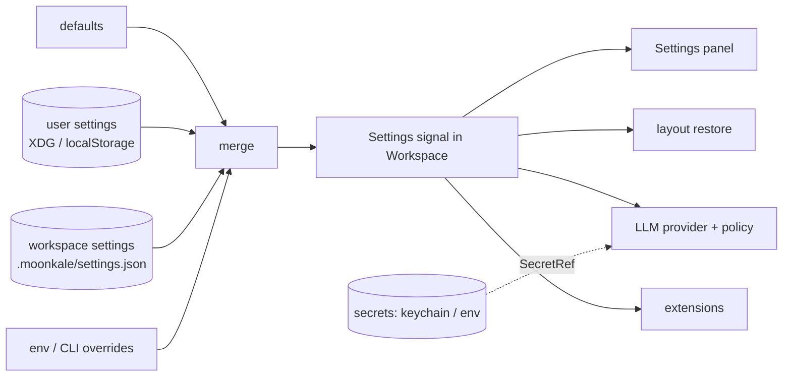

**Goal**: close the two gaps left open by Milestones 1–4 before the Phase 5 research items — *nothing is remembered between launches* and *the markdown editor is source-only, the agent read-only*. Record: [[Milestone 5 - Implementation Log]].

Order chosen by me (Daniel left it open): settings first because provider choice, policy overrides, extension permissions and remembered layouts all need a store; then Milkdown (P-11, deferred twice); then agent writes + MCP (the gate exists, nothing uses it). GPU layouts / wasmtime extensions / flow editor / mobile follow in Milestone 6+.

## Starting point (after Milestone 4)
- Nothing persists: default layout on every start, no recent folders, provider only via environment variables (`MOONKALE_LLM`, keys), `Policy::default()` hard-coded, no per-folder preferences.
- Already available: `dioxus-workbench` fires `on_layout_change(PanelLayout)` (with `PanelLayout::encode`/decode); the folder source can create files (`Op::CreateText`); `.moonkale/` is already used for transcripts; `.secrets/llm.env` holds the Mistral key outside git.
- Vault design notes touching this: [[Data Sources]] (`SecretRef`: keychain on desktop, env on server, Keystore on mobile), [[Project Structure]] (one line), [[Extension System]] (permissions UI needs a store).

## Scope: what "done" means
1. **Settings model** — one typed `Settings` struct with two scopes and a merge order: *built-in defaults* → **user** (per machine/account) → **workspace** (per opened folder, `.moonkale/settings.json`, committable) → *session overrides* (env vars, CLI). Keys never live in settings files: providers reference a `SecretRef` name resolved from the OS keychain (desktop), environment (server), or a prompt.
2. **Stores per platform** — desktop: `$XDG_CONFIG_HOME/moonkale/settings.json` (+ `keyring` for secrets); web: user settings in `localStorage`, workspace settings through the server (file in the folder); mobile: app data dir. All behind one `SettingsStore` trait in `ext-api`.
3. **What is remembered** — window layout per workspace (restored on open; *Reset Layout* still works), recent folders (File → Open Recent), last opened documents, the provider/model choice, policy overrides (allow writes for this workspace, denied tools), search/embedding on/off, terminal shell, theme placeholder.
4. **Settings UI** — a *Settings* panel (File → Settings, `Ctrl+,`): form for the fields above with the scope shown per field (user / workspace) and a raw JSON tab; changes apply live (signals) and save on change.
5. **Milkdown WYSIWYG** (P-11) — `packages/js/milkdown` behind `RichTextBackend`; markdown documents get *Source | Rich* toggle; Rust stays the owner of the text (round-trip: Milkdown emits markdown, `Document` stores it); wiki-links render as links and open on click.
6. **Agent writes** — tools `editor.replace` (splice a range in an open document, shown as a diff card before *Allow*), `file.create` (through `Op::CreateText`), `terminal.run` (a command in a new terminal session, output back as the result). All `Mutating` → *Ask* by default; a workspace setting can allow them for a session. Audit shows the diff.
7. **MCP server** on `api` (`/mcp`, streamable HTTP): the same `ToolDef`s and a server-side `ToolHost` over the registry, so Claude Code or another IDE agent can query an open workspace. Dev-server only, token from settings.
8. Web parity for all of it; E2E with the mock provider; documentation.

**Deferred to Milestone 6**: GPU layouts + 100k nodes (P-22), wasmtime extensions (P-23; permissions UI will be ready), flow editor + Lux.jl (P-24), mobile shell (P-25), Postgres/Turso (P-19), TypeDB/Helix (P-26), CRDT/presence (P-30/P-34).

## Architecture decisions for this milestone

- **Files are the store**: JSON with a `version` field, written whole on change (small), read once at start and when a folder opens. No database, no migration framework yet — a `version` bump plus a tolerant `serde(default)` deserialisation is enough for now.
- **Workspace settings are part of the folder** so a team shares policy and layout via git, and the index sees them like any file. `.moonkale/` gets a README explaining what lives there.
- **Secrets are not settings.** `SecretRef("mistral")` → desktop keychain entry `moonkale/mistral`, or env `MOONKALE_SECRET_MISTRAL`, or the `.secrets/*.env` file convention already in use. The Settings panel can store a key into the keychain; it never displays it.
- **Layout persistence uses the workbench's own encoding** (`PanelLayout::encode`), keyed by workspace; unknown panel ids are dropped on restore (an extension may be gone).
- **Milkdown is the third interop package** and follows the CodeMirror pattern exactly: `mount(el, markdown, onChange)`, whole-document events first, `PROTOCOL.md`, bundle committed.
- **Agent writes go through the existing `Document`/`Transaction` path**, never the filesystem directly: `editor.replace` produces a `TextPatch` on the open document (dirty state, undo, conflict check all apply), the user still saves.

## Steps

| # | step | crates | verify |
|---|---|---|---|
| 1 | `ext-api`: `Settings` struct, scopes, merge, `SettingsStore` trait; `Workspace::settings` signal; env overrides | ext-api | unit: merge order, tolerant decode |
| 2 | stores: desktop (XDG + `keyring`), web (localStorage + server file), mobile (data dir); workspace file via the folder source | desktop, web, api, mobile | unit: round trip; E2E: reload keeps a value |
| 3 | remembered state: layout per workspace, recent folders, last documents, provider choice, policy | ui, editors/agent, llm | E2E: reopen → same layout and documents |
| 4 | Settings panel (`Ctrl+,`) with scope badges and JSON tab | ui | E2E: change provider → header updates; toggle "allow writes" → tool runs without asking |
| 5 | Milkdown: `js/milkdown` bundle, `RichTextBackend`, Source/Rich toggle, wiki-link clicks | js/milkdown, editors/markdown | E2E: type in rich mode → markdown on disk; click a wiki-link |
| 6 | agent writes: `editor.replace` (diff card), `file.create`, `terminal.run`; audit diffs | llm, editors/agent | E2E with mock: propose → Allow → document dirty → Save |
| 7 | MCP server on `api` (`/mcp`), token from settings; try with Claude Code | api, llm | manual: `claude mcp add` → list sources |
| 8 | verify, log, vault | | |

## Risks
| risk | mitigation |
|---|---|
| Keychain on Linux needs a Secret Service (KDE Wallet / GNOME Keyring) | fall back to env / `.secrets` with a clear status message; never block on the keychain |
| Layout restore with panels that no longer exist | drop unknown ids, then reconcile with homes (workbench already does this) |
| Milkdown round-trip changes markdown formatting | keep *Source* as the canonical view; show a one-time notice when Rich mode rewrote the text; tests on the fixture notes |
| An agent write on a dirty document | `editor.replace` applies to the in-memory `Document` (the same buffer the user edits), so no external conflict; the version check still guards Save |
| MCP protocol drift | implement the minimal streamable-HTTP subset (initialize, tools/list, tools/call) behind a feature; document what is not supported |
