Phases group the [[Problem Ranking]] into deliverables a user can touch. Each phase ends with something runnable on **desktop and web** (mobile catches up in Phase 5).

```mermaid
gantt
  title Moonkale phases (relative, not dated)
  dateFormat X
  axisFormat %s
  section 0 Skeleton
  Crate skeleton + vault (done)        :done, p0, 0, 1
  section 1 Walking skeleton
  P-01 core model + Source            :done, p1a, 1, 3
  P-02 folder source + explorer       :done, p1b, after p1a, 1
  P-03 JS interop protocol            :done, p1c, after p1a, 1
  P-04 code editor (CodeMirror)       :done, p1d, after p1c, 2
  P-05 extension API + static reg     :done, p1e, after p1d, 2
  section 2 Graph appears
  P-06 index + wiki-links             :done, p2a, after p1e, 2
  P-07 graph view v1                  :done, p2b, after p2a, 3
  P-08 SQLite/DuckDB + table          :done, p2c, after p1e, 2
  P-09 markdown source mode           :done, p2d, after p2a, 1
  section 3 Databases & tools
  P-10 remote source (web parity)     :p3a, after p2c, 2
  P-11 Milkdown WYSIWYG               :p3b, after p2d, 2
  P-12 Typst                          :p3c, after p2d, 1
  P-13 terminal                       :p3d, after p1e, 1
  P-14 LSP                            :p3e, after p1d, 2
  P-15 Ladybug/Falkor                 :p3f, after p2c, 1
  P-16 cross-source edges             :p3g, after p3f, 2
  section 4 Agents
  P-17 LLM gateway + policy           :p4a, after p3a, 2
  P-18 embeddings + hybrid search     :p4b, after p4a, 2
  P-19 Postgres/Turso                 :p4c, after p3a, 1
  P-20 remote LSP/terminal (secure)   :p4d, after p3d, 2
  P-21 traces/AST                     :p4e, after p2b, 1
  section 5 Scale & extend
  P-22 GPU layouts + desktop surface  :p5a, after p2b, 4
  P-23 wasmtime extensions            :p5b, after p4a, 3
  P-24 flow editor + Lux.jl           :p5c, after p3d, 3
  P-25 mobile                         :p5d, after p3a, 3
  P-26 TypeDB/Helix                   :p5e, after p3f, 2
  section 6 Research
  P-27 3D                             :p6a, after p5a, 1
  P-28 browser wasm extensions        :p6b, after p5b, 3
  P-29 native backends                :p6c, after p5a, 5
```

## Phase deliverables

| Phase | You can… | Proves |
|---|---|---|
| **1 Walking skeleton** ✅ | open a folder, edit and save files in a dockable workbench, on desktop and web (server-side folder) | the model, the interop boundary, the extension API — **done 2026-09-17**, see [[Milestone 1 - Walking Skeleton]] / [[Milestone 1 - Implementation Log]] |
| **2 Graph appears** ✅ | see your folder + wiki-links + symbols as a graph; open a SQLite file and browse tables; edit markdown with backlinks | "graph-native" is real; wgpu works in webviews — **done 2026-09-18** (DuckDB deferred), see [[Milestone 2 - Implementation Log]] |
| **3 Databases & tools** ✅ | use a terminal, preview Typst, get LSP diagnostics/hover/definition, open a LadybugDB and draw Cypher results — on desktop and web (tools run on the server) | server-as-backend; second/third interop packages — **done 2026-09-18** (Postgres/Falkor/Milkdown deferred to 4), see [[Milestone 3 - Implementation Log]] |
| **4 Agents** | chat with an agent that queries your sources under policy; hybrid search; click a stack trace into a graph | LLM-as-user |
| **5 Scale & extend** | 100k-node graphs; install third-party wasm extensions; build a Lux.jl model by drag-and-drop; use it on a phone | the two hardest bets |
| **6 Research** | 3D; extensions in the browser; a JS-free desktop | long-term direction |

## Principles for sequencing
1. **Risky things early, but not first.** P-01 is first because it must be; P-05 waits for one real editor; P-22 waits for measurements from P-07.
2. **Every phase ends runnable on two platforms.** No "we'll do web later" — that's how single-platform assumptions leak in.
3. **Built-ins go through the extension API from Phase 1.** Retrofitting is how privileged paths appear.
4. **Log every problem.** [[Problem Log]], one note per `P-nnn` using [[Problem Template]].
