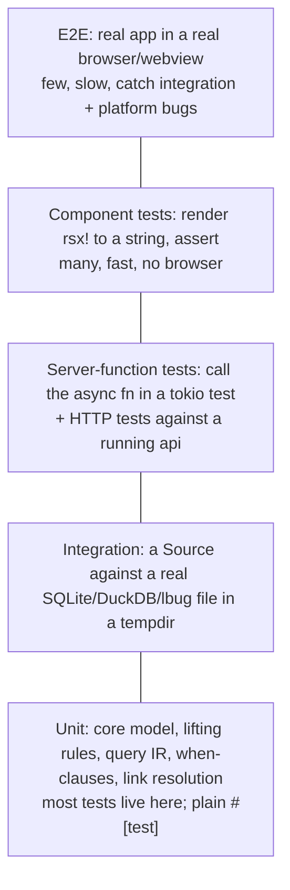

A fullstack Dioxus workspace has five different kinds of code, and each is tested differently. Knowing which kind you're looking at tells you which tool to reach for. The companion note [[How to Write Tests]] is the hands-on walkthrough.

## The pyramid, mapped to this repo

| kind of code | where | test with | runs on |
|---|---|---|---|
| Pure logic (model, parsers, lifting, layouts) | `core`, `sources::lift`, `index::extract`, `editor-graph::layout` | `#[test]`, `proptest` for invariants, `insta` snapshots for structures | `cargo test` native, fast |
| Components (`rsx!`) | `ui`, `editors/*` | build a `VirtualDom`, `rebuild_in_place()`, `dioxus_ssr::render` → assert on the HTML string; `insta` for snapshots | native, no browser |
| Server functions | `api` | call them as normal async fns under `#[tokio::test]` with the `server` feature; HTTP-level tests with `reqwest` against `dx serve`/a test server | native |
| Sources / drivers | `sources-*`, `project-fs` | integration tests in `tests/` with a tempdir DB; containers (`testcontainers`) for Postgres/Redis/Falkor | native, some need Docker |
| Browser-only behaviour (interop, wasm) | `packages/js`, wasm paths | `wasm-bindgen-test` in headless Firefox/Chrome; JS unit tests with `vitest` for the bundles | wasm |
| Whole app | `web`, `desktop` | E2E: headless Firefox screenshot/DOM checks (what we did for the dummy UI); Playwright later | browser |
| Extensions | any | `TestHost` from `ext-api` (in-memory sources, recorded calls) | native |

## Principles
1. **Test at the seam you designed.** The traits in this project (`Source`, `CodeEditorBackend`, `Extension`, `Layout`) exist to be swapped — so they are also where fakes go. A `FakeSource` in `core` test utils is the single most valuable test fixture in the repo.
2. **Push logic down the pyramid.** If a component test needs a database, the logic is in the wrong layer. Components should be thin over signals; test the signal logic with plain functions.
3. **Snapshot what is structural, assert what is semantic.** `insta` snapshots for rendered HTML and lifted graphs; explicit asserts for "the FK became an edge from A to B".
4. **Property tests for the model.** `Transaction` apply/undo round-trips, deterministic ids (`derive(a) == derive(a)`), `WhenClause` parse/print, layout stability under permutation.
5. **Every platform-gated module gets a compile test.** `cargo check -p web --target wasm32-unknown-unknown` in CI proves no native crate leaked in ([[Platform Matrix]]).
6. **E2E is for integration and platform bugs only.** Keep them few; they found both CSS bugs in the dummy UI ([[P-002 Dioxus mount point and full-height layout]], [[P-003 dioxus-workbench theme variables]]) that no unit test could.

## Tooling
- `cargo nextest` for parallel, per-test-process runs (a panicking test can't take the others down; matters with C++ drivers).
- `cargo test --workspace --exclude web` for the native suite; a separate wasm job.
- `cargo clippy --workspace` — the repo's `clippy.toml` already bans holding signal guards across `.await`; keep it.
- `cargo fmt --check`.
- CI matrix (planned): linux-native, linux-wasm-check, linux-webkitgtk-e2e, macos-native.

## What we test *first* (Phase 1)
1. `core`: ids, `PropertyMap`, `Transaction` apply/undo, `WhenClause`.
2. `project-fs`: tree building with `.gitignore`, patch application atomicity, watch coalescing (tempdir + `notify`).
3. `ui`: the workbench shell renders the registry's panels (component snapshot).
4. `api`: `echo` (exists) and, once real, `query/fetch/apply` over a `FakeSource`.
5. One E2E: open the web build, assert the workbench and one panel exist.
